视频地址，课件和笔记可见官网。

[【油管英字】CS224w 斯坦福图网络机器学习2019_哔哩哔哩 (゜-゜)つロ 干杯~-bilibili](https://www.bilibili.com/video/av90106649?p=10)

CS224W | Homeweb.stanford.edu

前面一直在说GNN非常吊,效果非常好. GNN就没有缺点和局限?

这一节就聊聊GNN的局限

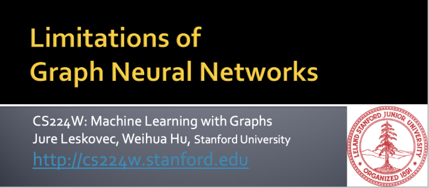

GNN的关键在于对图结构的捕获,也就是邻居的聚合. 但是在某些情况下, 不同的图结构,GNN可能无法区分(当然有些GNN是可以区分的). 注意,这里做了非常多的简化, 所有节点的特征认为都是一样的, 用黄色颜色表示. 

这里就引发我们的思考了.

1. 即使简化后的理论分析或者证明可以说明GNN的局限性.但是,我们在实际使用GNN的时候,节点的特征往往是不同的. 这时候,GNN能区别不同的图结构吗??
2. 任意图结构都不能区分吗? 这肯定是不可能的. 应该说GNN对某些图结构不可区分. 

另一个就是不够鲁邦,容易被攻击. 至于Noise的话,引入邻居的权重聚合可以一定程度上解决,比如GAT.

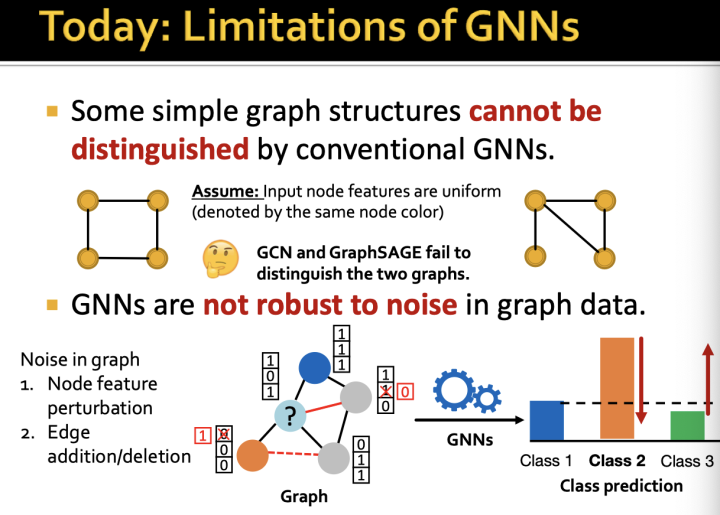

-图同构测试 graph isomorphism test就是用来测试两个图的结构是否一样.

这是一个非常非常难的问题 NP-hard的

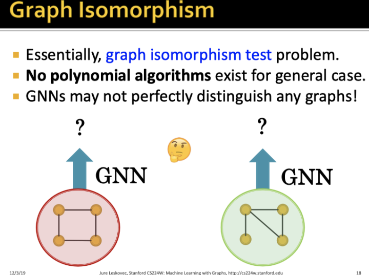

-那么,如果用GNN来做图同构测试可以吗?

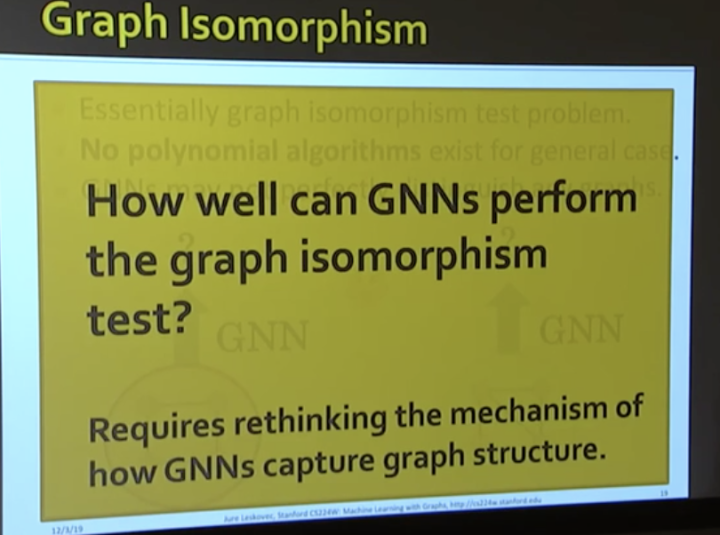

-回顾下之前GNN的聚合过程,可以展开成一个子树结构,按层来聚合.

根据展开后的邻居子树的不同, GNN可以把不同的节点映射为不同的表示.

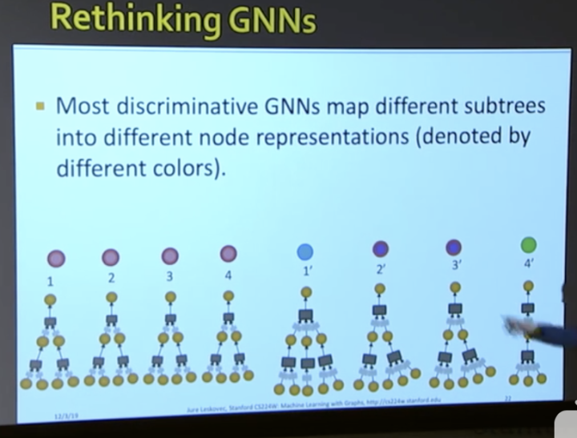

-两个子树结构的例子

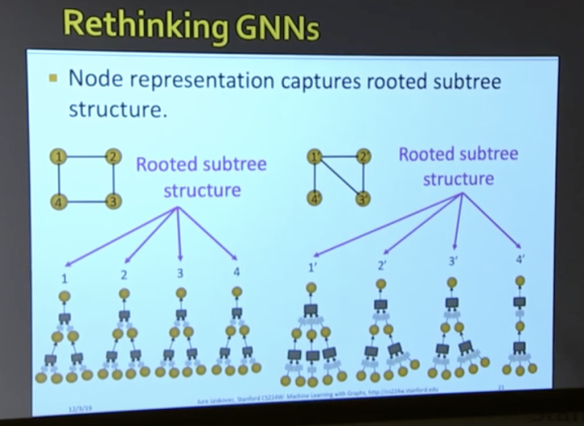

- 这里引入一个 单射 Injectivity 的概念. 简单来说就是:一个输入会映射到一个输出; 不同输出映射到不同的输出.
- 对应到GNN中就是,一个节点的子树结构(输入)不同,那么其向量表示(输出)就不同.

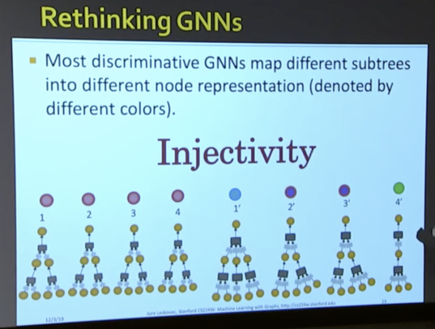

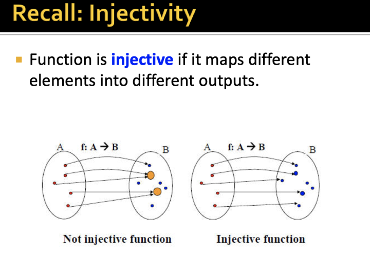

-GNN的整个聚合过程如果要满足"单射"的话,那么每一步(或者每一层)子树的聚合都要是单射的. 

这个很好理解, f(x)和g(x)都是单射的, 那么f(g(x))也是单射的.

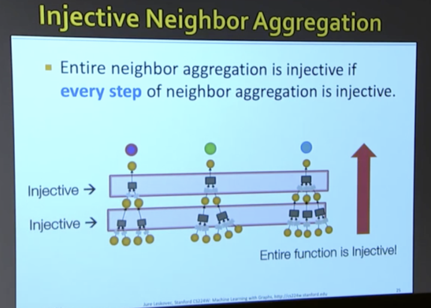

这里先针对一层的聚合函数是否是"单射"进行研究. 这里先研究函数的输入:节点的邻居集合.

这里先介绍一个概念 multi-set.

计算专业的人对set的概念应该都很清楚,毕竟写代码的时候经常会用到

multi-set和set差不多, 但是multi-set里面允许有重复的元素

比如下图中的第2个multi-set包含了2个黄色,1个蓝色

为什么要搞multi-set呢?其实是为了更好的描述节点的邻居集合.

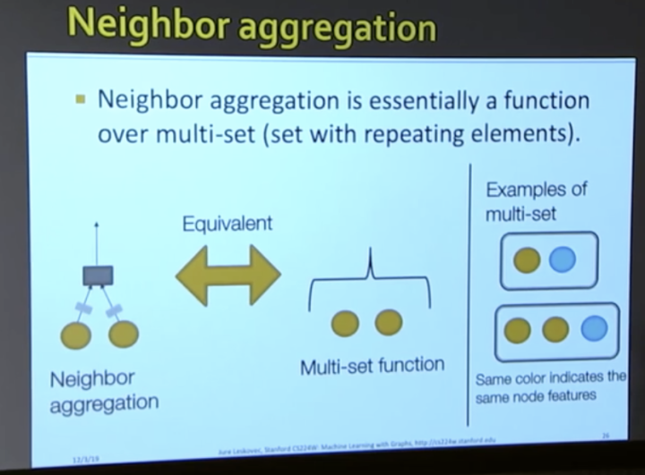

现在GNN的输入有了比较清晰的定义

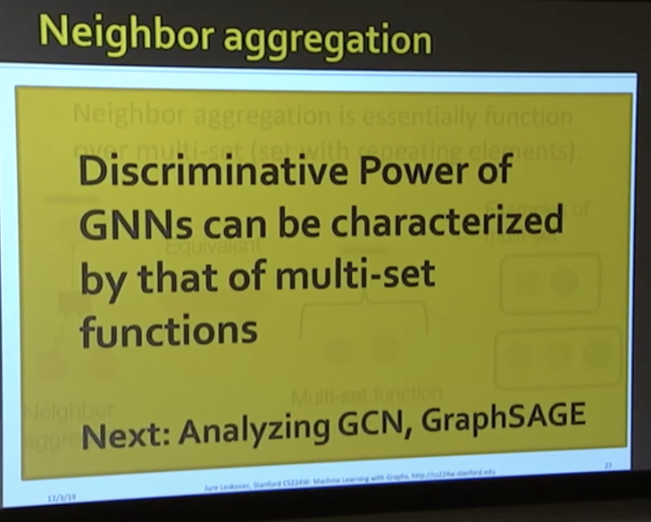

-这里我们先看看GCN中的对邻居做平均 mean-pooling是不是单射的

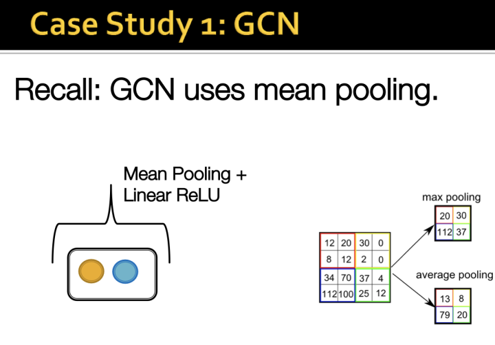

-GCN中的Mean-pooling不是单射的为什么呢?

假定两个不同的节点, 节点1的邻居是1个黄色,1个蓝色, 节点2的邻居是2个黄色,2个蓝色, 

如果对两个节点的邻居做mean pooing,结果都是0.5个黄色+0.5个蓝色,也就是说无法区分节点1和2.

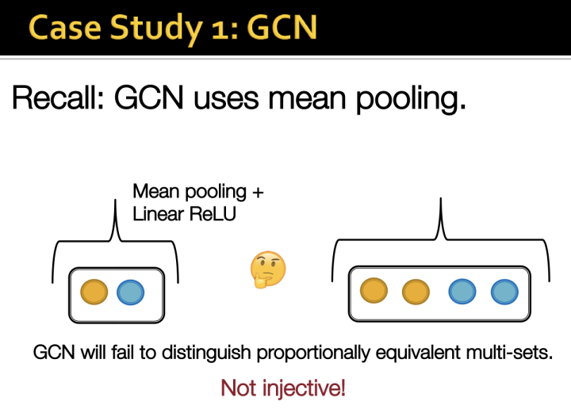

-这里在稍微延伸下, 还有哪些聚合方式是非单射的

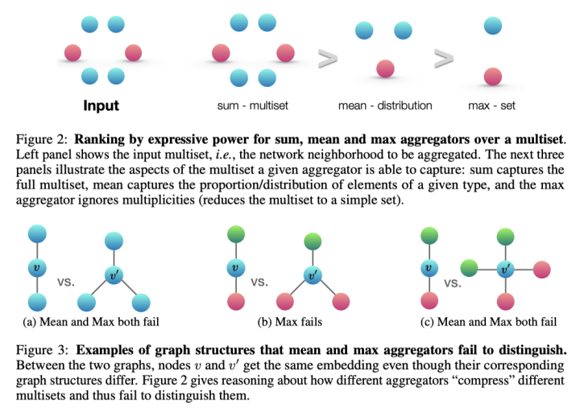

-那么,到底什么样的函数是单射呢?

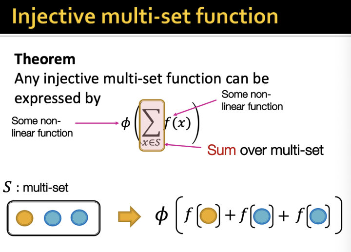

-很自然的, 这里的\phi和f都可以用NN来做

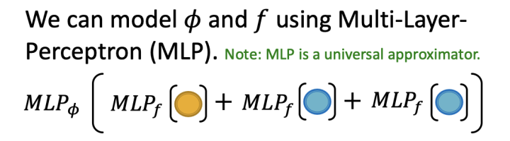

-这里就引入一篇ICLR2019的 GIN了,一篇可以实现单射的GNN

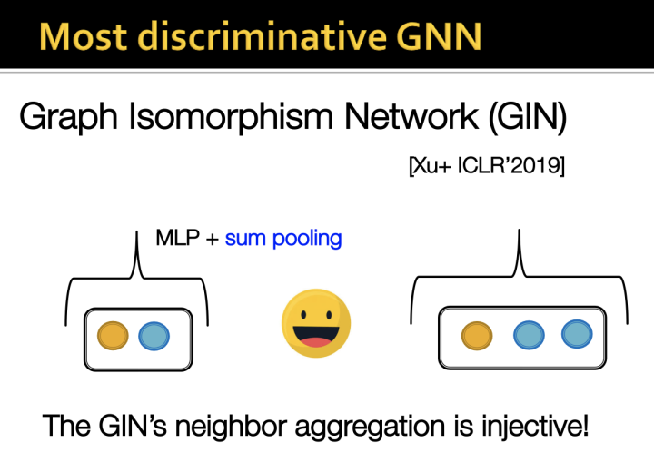

-还是之前的例子. 下面两个图, GCN和GraphSAGE是无法区分的

那么我们看看GIN的Sum pooling是怎么区分的?

可以看出来对于不同的子树结构, GIN聚合出了不同的表示.

比如右边的4棵子树(对应4个节点的邻居展开), 结构不同,最后的节点表示也是有4种.进而整个图的表示也是不同的. 这样,GIN就可以把不同的图结构进行区分.

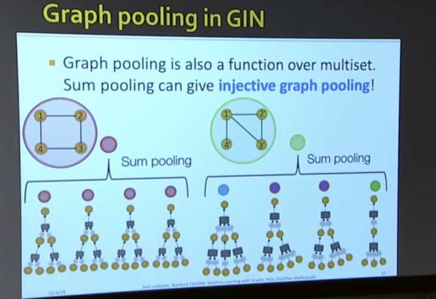

-上面的例子说明了GIN非常厉害,通过在multi-set上的injective聚合来实现对图结构的精准区分.

但是,GIN为什么会这么强呢?

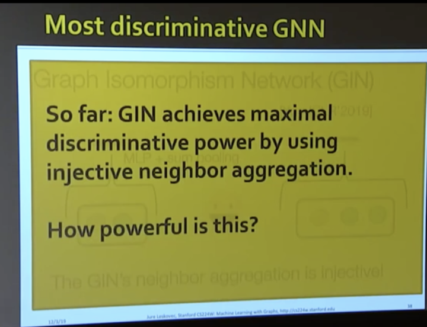

-回忆我们之前说的图同构问题. 其实对于图同构的问题,可以通过WL测试来检验两个图是否是同构的.

那么, GIN这么吊也能区分, 和WL test有什么关系呢?

下图可以看出, 两者都是讲图展开为子树结构,然后进行分析.

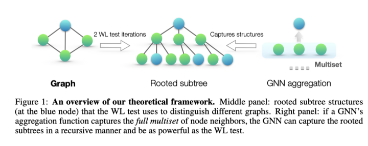

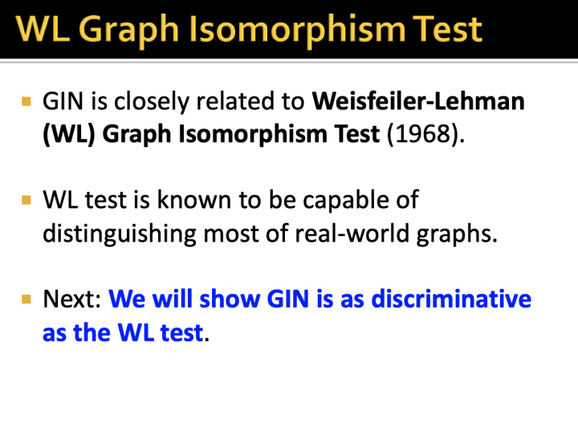

更多关于图神经网络/图表示学习/推荐系统, 欢迎关注我的公众号 【图与推荐】

