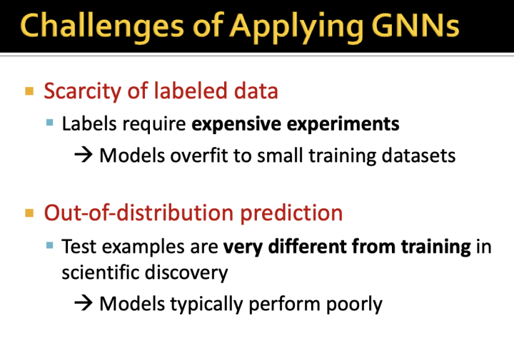

[TOC]

# CS224W 18-Limitations of Graph Neural Network

视频地址，课件和笔记可见官网。

[【油管英字】CS224w 斯坦福图网络机器学习2019_哔哩哔哩 (゜-゜)つロ 干杯~-bilibili](https://www.bilibili.com/video/av90106649?p=10)

[CS224W | Home](http://web.stanford.edu/class/cs224w/)

更多关于图神经网络/图表示学习/推荐系统, 欢迎关注我的公众号 【图与推荐】

前面一直在说GNN非常吊,效果非常好. GNN就没有缺点和局限?

这一节就聊聊GNN的局限

## Gnn的局限

GNN的关键在于对图结构的捕获,也就是邻居的聚合. 但是在某些情况下, 不同的图结构,GNN可能无法区分(当然有些GNN是可以区分的). 注意,这里做了非常多的简化, 所有节点的特征认为都是一样的, 用黄色颜色表示. 

另一个就是不够鲁邦,容易被攻击. 至于Noise的话,引入邻居的权重聚合可以一定程度上解决,比如GAT.

这里就引发我们的思考了.

1. 即使简化后的理论分析或者证明可以说明GNN的局限性.但是,我们在实际使用GNN的时候,节点的特征往往是不同的. 这时候,GNN能区别不同的图结构吗??
2. 任意图结构都不能区分吗? 这肯定是不可能的. 应该说GNN对某些图结构不可区分. 

### 图同构测试

-图同构测试 graph isomorphism test就是用来测试两个图的结构是否一样.

这是一个非常非常难的问题 NP-hard的

-那么,如果用GNN来做图同构测试可以吗?

-回顾下之前GNN的聚合过程,可以展开成一个子树结构,按层来聚合.

根据展开后的邻居子树的不同, GNN可以把不同的节点映射为不同的表示.

-两个子树结构的例子

### 单射函数

这里引入一个 单射 Injectivity 的概念. 简单来说就是:一个输入会映射到一个输出; 不同输出映射到不同的输出.

- 对应到GNN中就是,一个节点的子树结构(输入)不同,那么其向量表示(输出)就不同.

-GNN的整个聚合过程如果要满足"单射"的话,那么每一步(或者每一层)子树的聚合都要是单射的. 

这个很好理解, f(x)和g(x)都是单射的, 那么f(g(x))也是单射的.

这里先针对一层的聚合函数是否是"单射"进行研究. 这里先研究函数的输入:节点的邻居集合.

### multi-set.

这里先介绍一个概念 multi-set.

计算专业的人对set的概念应该都很清楚,毕竟写代码的时候经常会用到

multi-set和set差不多, 但是multi-set里面允许有重复的元素

比如下图中的第2个multi-set包含了2个黄色,1个蓝色

为什么要搞multi-set呢?其实是为了更好的描述节点的邻居集合.

现在GNN的输入有了比较清晰的定义

-这里我们先看看GCN中的对邻居做平均 mean-pooling是不是单射的

-GCN中的Mean-pooling不是单射的为什么呢?

假定两个不同的节点, 节点1的邻居是1个黄色,1个蓝色, 节点2的邻居是2个黄色,2个蓝色, 

如果对两个节点的邻居做mean pooing,结果都是0.5个黄色+0.5个蓝色,也就是说无法区分节点1和2.

-这里在稍微延伸下, 还有哪些聚合方式是非单射的

-那么,到底什么样的函数是单射呢?

-很自然的, 这里的$\phi$和f都可以用NN来做

### GIN

这里就引入一篇ICLR2019的 GIN了,一篇可以实现单射的GNN

-还是之前的例子. 下面两个图, GCN和GraphSAGE是无法区分的

那么我们看看GIN的Sum pooling是怎么区分的?

可以看出来对于不同的子树结构, GIN聚合出了不同的表示.

比如右边的4棵子树(对应4个节点的邻居展开), 结构不同,最后的节点表示也是有4种.进而整个图的表示也是不同的. 这样,GIN就可以把不同的图结构进行区分.

-上面的例子说明了GIN非常厉害,通过在multi-set上的injective聚合来实现对图结构的精准区分.

但是,GIN为什么会这么强呢?

-回忆我们之前说的图同构问题. 其实对于图同构的问题,可以通过WL测试来检验两个图是否是同构的.

那么, GIN这么吊也能区分, 和WL test有什么关系呢?

下图可以看出, 两者都是讲图展开为子树结构,然后进行分析.

WL test第二步: 对子树进行分类整理,也就是所谓的counts different colors.

左边是4颗一模一样的子树

右边是2颗紫色子树, 1颗蓝色子树,1颗绿色子树.

-WL test第三步 比较整理后的结果.如果一样,两个图就是同构的

-这里再看一个WL test的例子(引自[CSDN-专业IT技术社区-登录](https://blog.csdn.net/yyl424525/article/details/102841352))

（a）网络中每个节点有一个label，如图中的彩色的1，2，3，4，5

（b）标签扩展：做一阶广度优先搜索，即只遍历自己的邻居。比如在图（a）网络G中原(5)号节点，变成(5,234)，这是因为原（5）节点的一阶邻居有2，3和4

（c）标签压缩：仅仅只是把扩展标签映射成一个新标签，如 5,234 => 13

（d）压缩标签替换扩展标签

（e）数标签：比如在G网络中，含有1号标签2个，那么第一个数字就是2。这些标签的个数作为整个网络的新特征

WL test的复杂度是O(hm)，其中h为iteration次数，m是一次iteration里multiset的个数。

-正是由于WL test和GIN的操作非常像,所以GIN的能力能够和WL test一样强.

-WL test非常厉害,但是偶尔有些情况也是不work的 这里给了一个WL test不work的例子.

-下图展示了GIN的分类能力

最上面那条横线代表WL test, 准确度是1.

这里3种GNN只有GIN能达到WL test的准确度.

也就是说,实验结果和前面的分析完全符合.

-还记得前面在分析GNN的能力的时候,我们做了一个非常强的假设.也是就所有的节点的特征都是一样的.

下图可以看到,在满足特征一致假设的情况下, GIN远远优于GCN和GraphSAGE.

在节点特征存在的时候,GIN的优势就没有那么大了.

这里补充一下为什么Mean和Max的聚合(对应下图(a))对于无特征或者说所有节点特征一样的情况下,为什么GNN就失效了. 

-最后总结一下

大部分的GNN都不是单射的,因此,其对不同图结构的判别能力比较差.

GIN是单射的,因此其能力和WL test一样强.

截止到这里,GNN第一个缺陷就说完了.

## GNN的鲁棒性

另一个GNN的问题就是容易收到噪音的影响,不够鲁棒.

这不是只是GNN的问题,NN中也存在,也有相应的对抗攻击专门研究这个

这里的攻击并不是大规模的公式,比如加入非常多非常强的噪音.

对应到图上的攻击,也是"小动作"攻击,比如改变少量节点或者边.

-听起来很高大上,其实攻击在我们生活中是非常常见的

-下面就具体的GNN在攻击面前是什么样子的.

这里以GCN做了一个例子,关于GCN的东西这里不再赘述.

-假设我们想攻击红色节点(比如改变model对其标签的预测),此时能够攻击的节点是其两个1阶邻居. 那么有2个方法

1. 直接,改变红色的节点的特征/连接情况.
2. 见解,这里有种"隔山打牛"的意思, 通过改变被攻击节点的邻居来间接影响GNN对红色节点的预测. 为什么这样有效的呢? 正是由于gnn的聚合过程导致的. GNN通过聚合邻居来学习节点表示进而预测,如果输入是错的(邻居被恶意修改),那么预测也是错的.

-那么如何形式化的定义图上对抗攻击呢? 就是尝试用公式来描述攻击过程.

总的来说就是:在有限的攻击下,能够最大化的误导模型预测.

-图上的攻击主要有两种

1. 攻击结构, 就是修改邻居矩阵A
2. 攻击属性,就是改变节点属性X

同时,攻击还不能太明显.

-下面这个更加清晰的展示了攻击前后,模型预测的变化.

攻击前,节点v属于类别c_old(也就是第三个柱形),

攻击后,节点v属于类别c_old(也就是第三个柱形)的概率被压低了.与此同时, 节点v属于类别c(也就是第四个柱形)的概率被提升了.

也就是说攻击前后,节点v属于不同类别的概率发生了变化,攻击成功.

-听起来好像攻击很容易,但是实际上:

1. 修改A和X的操作都是离散的, 没法用SGD优化
2. 定义中的GCN是基于修改后的A'和X'训练的,也就是说每修改/攻击一次,就要重新训练GCN.这谁顶得住啊...

-对应上面两个难题,有两个解法

1. 贪婪搜索
2. 简化GCN的训练过程

-下面是一个攻击的例子

作者用5个GCN对一个节点的标签进行预测.

攻击前,所有的GCN都认为这个节点属于class5

攻击后,所有GCN都认为这个节点属于class6

-实验结果验证了作者的猜想:GNN非常容易被攻击. 在微小的攻击下,模型预测就会大幅度改变.

## GNN的应用挑战.

最后作者简单介绍了GNN的应用挑战.

-有攻击就有防守. 也有一些工作研究如何使得GNN对攻击更加鲁棒.

更多关于图神经网络/图表示学习/推荐系统, 欢迎关注我的公众号 【图与推荐】

