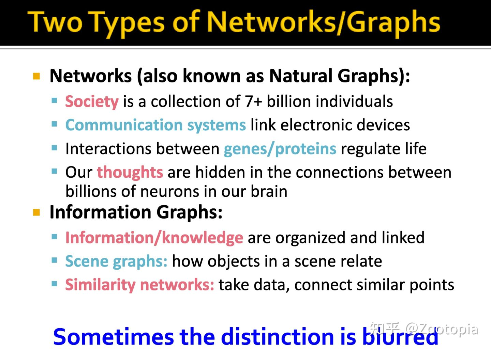
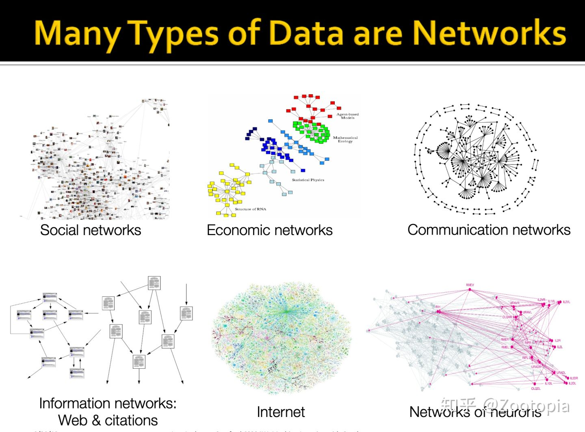
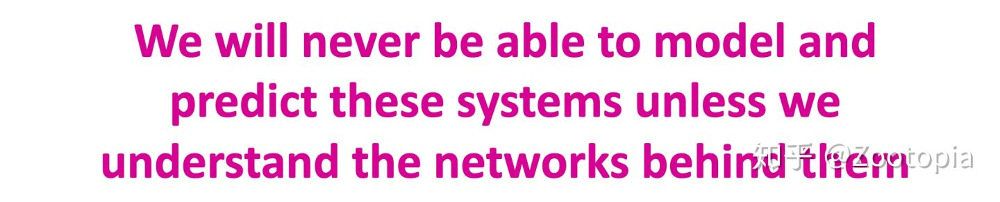
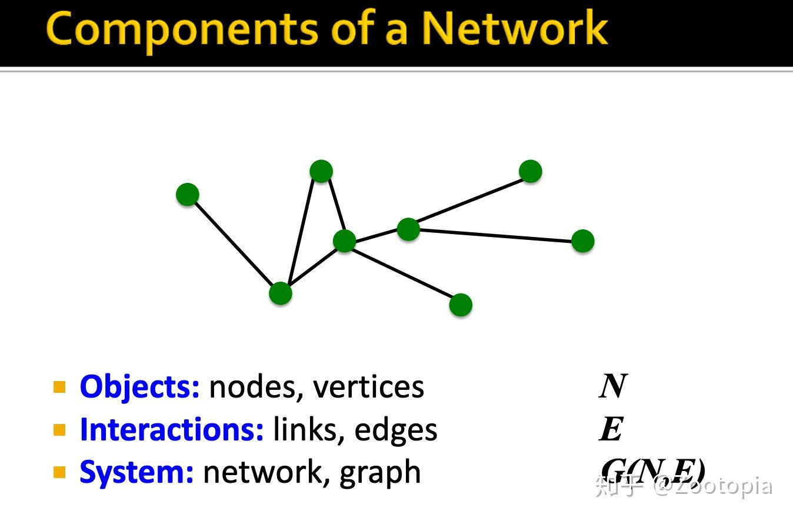
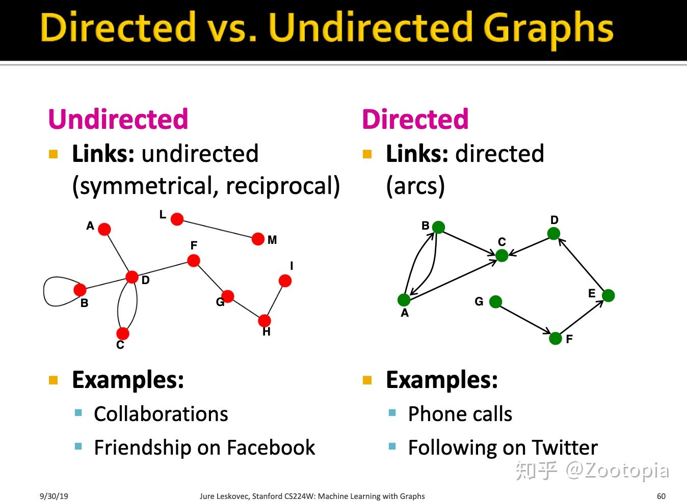
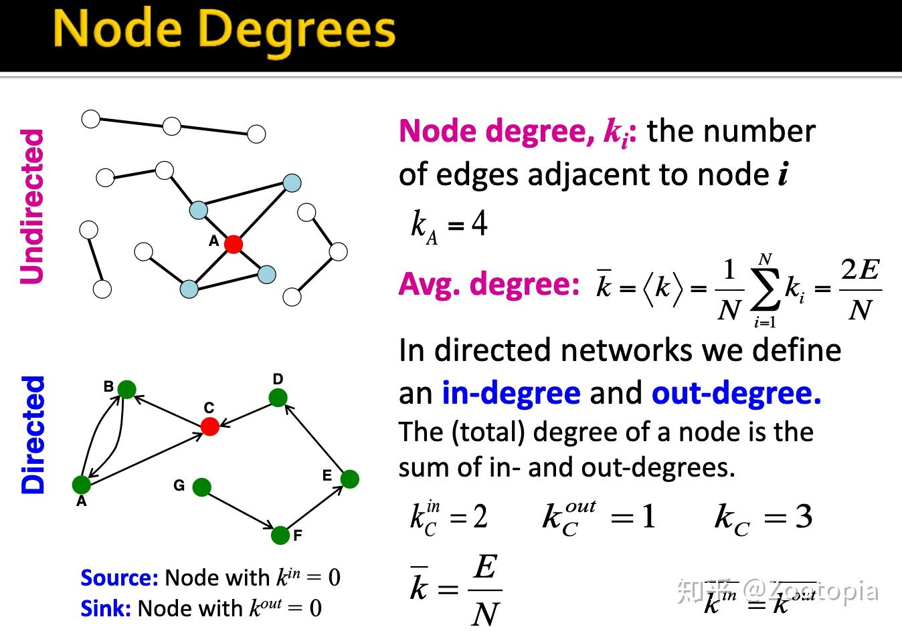
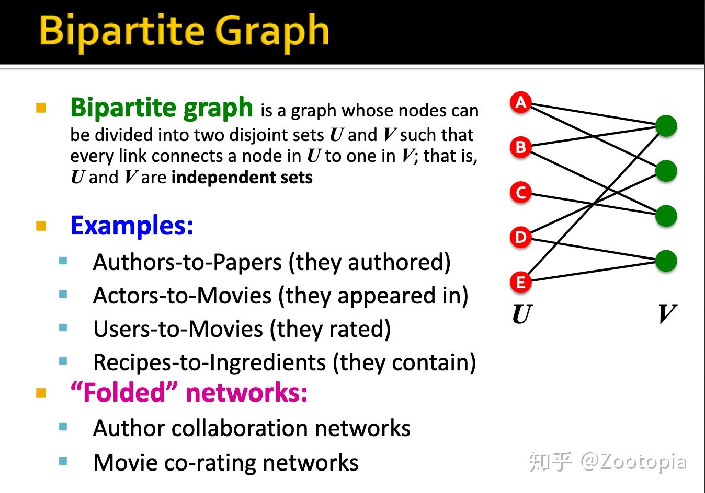
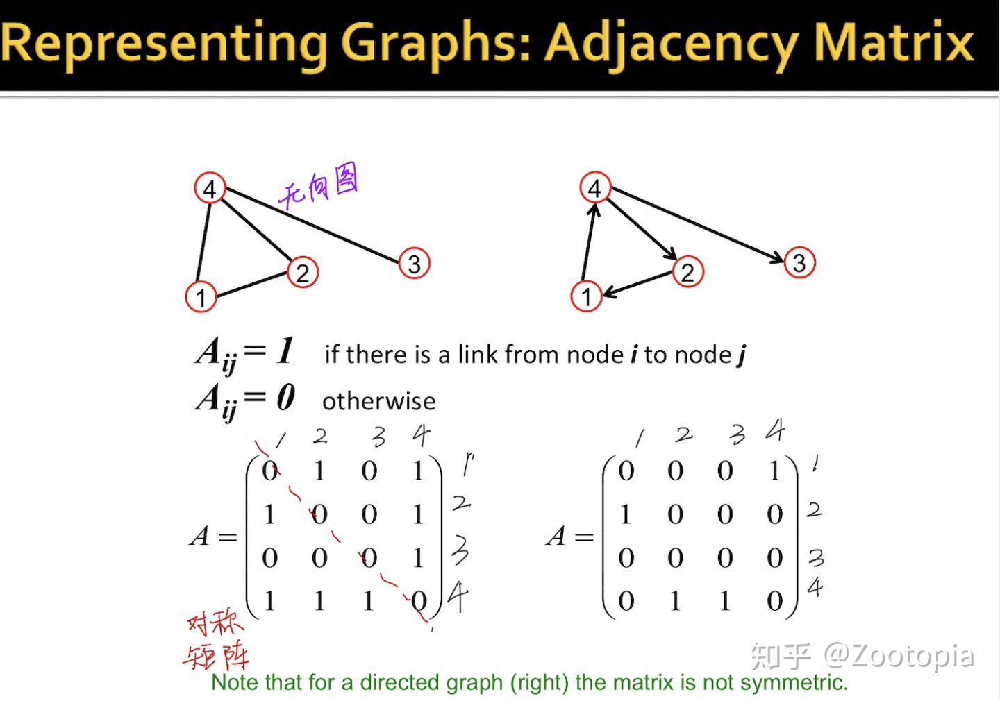
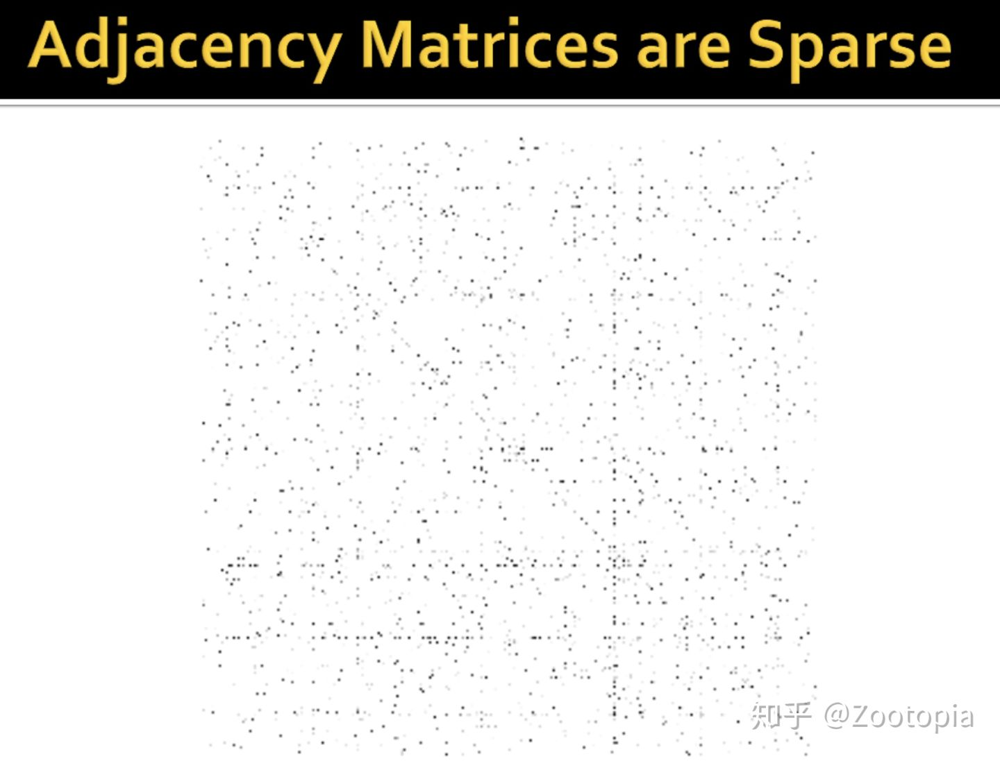

# Introduction

## graph的分类

（1）Networks (also known as Natural Graphs):其实就是我们实际生活中会遇到的真实的图，比如社会人际关系、基因组、我们的想法

**本质上这些是给定了一个domain，上面的所有信息可以建立一个networks，我们好利用networks/graphs更好的理解这个domain**

（2）information graphs:这一类更关心的是**各个个体之间的联系**，从而可以做比如分类任务等





比如social networks：可以查询到谁follow了谁等信息；information networks可以查询谁引用了谁的文章等、或者研究科学的进化是一个怎样的进程

**研究graph的目的/意义**



> 举一个笔者个人认为很重要的现实意义：目前新型冠状病毒，因为春运的原因，人员走动非常的广，没有办法人工去追踪，那么这时候利用大数据建立一个social networks，可以较好的将所有潜在的感染者找出来，从而切断传染源。

## structure of graphs

怎么描述一个网络？

图其实是network的一种数学表示

- networks可以视为一种通用的语言，用来描述不同domain下个体之间的联系。
- 根据什么样的属性来考虑个体之间的联系，就称为xxxnetwork（xxx表示的就是你基于的联系属性）。

所以如何选择graph representation？



- undirected graphs（无向图）：比如像微博上，我关注了你，你并没有关注我，我和你之间的这个联系并非是双向的
- directed graphs（有向图）： 电话-一定有一人拨打电话和另一断接听电话，是双向的



节点的度：（1）在undirected graph中这个度表明的就是这个节点连接的其他节点数量

```text
我们也可以理解为微博中，你的粉丝数量+关注数量-互粉数量
```

（2）在directed graph中这个度反映的就更加精准：分为in-degree和out-degree

```text
in-degree可以理解为粉丝数量，out-degree可以理解为关注数量（你关注别人）。注意到这里ppt上
的C是没有双向箭头的。
```

有一类特殊的图：二分图



这种图结构很有用：当你的nodes是不同的类型的时候，按照类型分类(disjoint sets)。如作者作为U类，论文作为V类。

**怎么表示一个图？**

（1）邻近矩阵A：通俗的理解就是将每个节点之间是否存在连接（1 or 0)通过矩阵形式表示出来



我们可以试一下将0表示为白色，1表示为黑色点将邻近矩阵画出来：可以发现邻近矩阵是**稀疏**的



**note**

**现实中大部分networks都是稀疏的（***稀疏--非常好的性质***）**

```text
这样我们把graph表示成矩阵-稀疏矩阵，所占内存将减少很多
```


