# Properties of Networks, Random Graph

图网络的基础知识还是蛮深的，笔者听着觉得耗很多脑细胞。代码块里大部分是笔者个人理解，希望大家多指导和讨论～

## networks的性质--怎么度量一个network？

（1）度的分布（degree distribution):

首先什么是度（degree）：根据邻近矩阵的信息，对每一个节点来计算其度（行和）

```text
形象的理解：数一数每一个节点都有几条连接线（也就是这个节点的度）
```

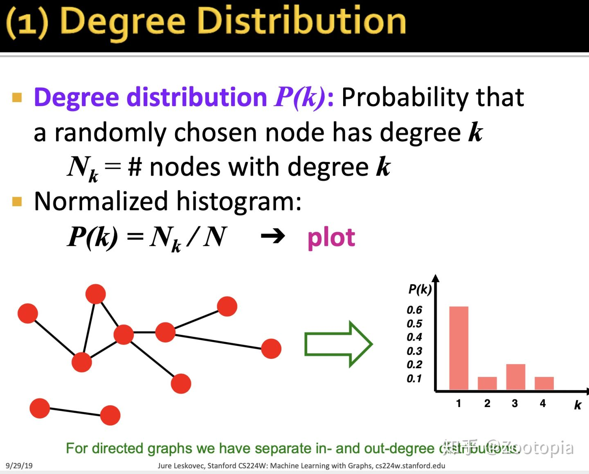

那度分布P(k)表示的是**随机选择一个具有度为k的节点的概率**

N（k）表示的是具有度为k的节点个数

有了这个N_k之后，对其进行归一化（也就是N（k)/总节点数）利用直方图画图

```text
这样的方式就能从概率分布的角度直观的看到节点度的分布情况，例如从上图中我们可以观察到（微博用户，其中
1用户的关注+粉丝数量是比较大的，或者说用户1的活跃度是比较高的）
```

（2）图中的路径paths in a graph

也就是两两相邻节点进行连接后的路径---和我们常说的连通路径很类似

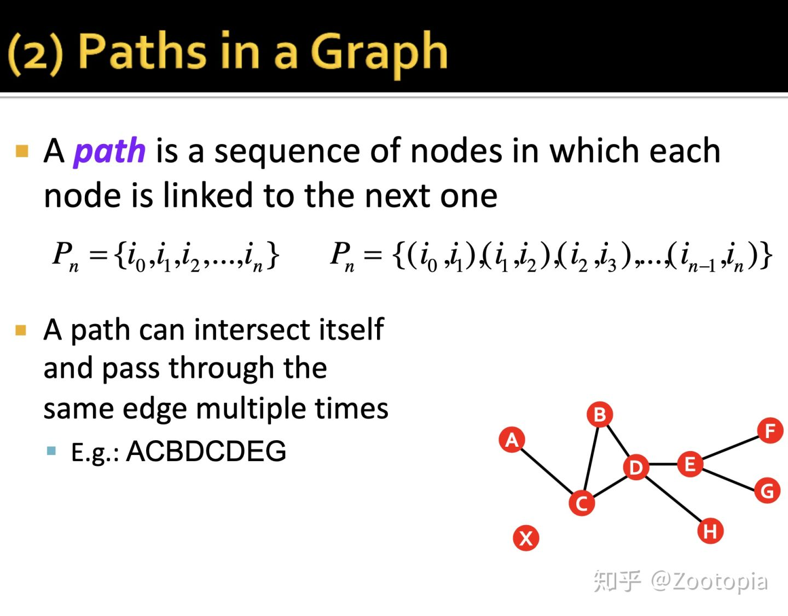

（3）图中的距离 distance in a graph

```text
回顾我们数学基础课中定义的一个点到一个平面的距离：最短的路径
```

- 无向图中

图中的距离也可以约等于最短的路径，比如图中点B到D的距离（如果我们假设每两相邻节点之间连线数值为1）是2，那么点A到x则是无穷（因为没有路径） 

- 有向图中（距离不满足对称性）因为在有向图中我们**要跟着箭头走**

所以图中的B到C的距离是1，而节点C到节点B的距离则是2（C到A到B）

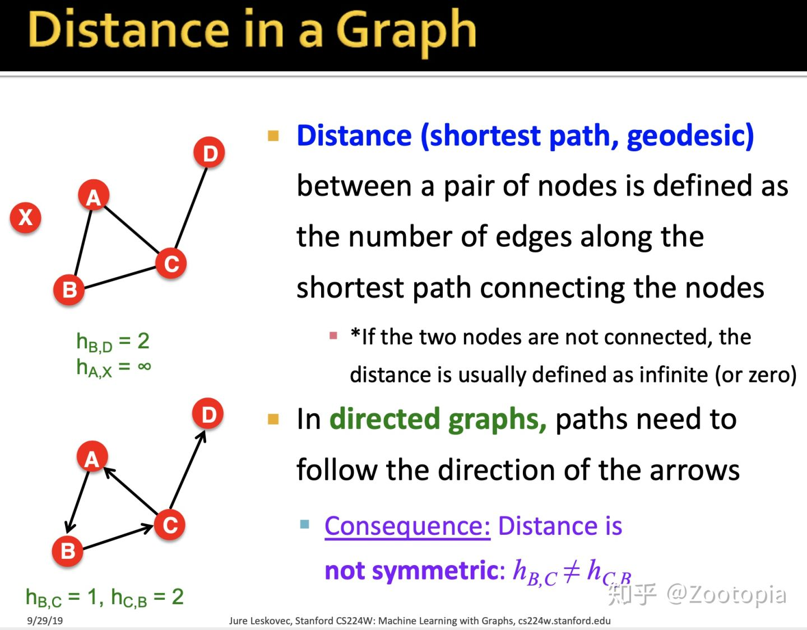

（4）聚类系数 clustering coefficient（针对无向图）

这个系数的提出是基于思考这样一个问题：**节点i的neighbors都是如何连接的？**

```text
比如微信上，我作为节点i，我想看看我的朋友圈（neighbor)互相之间了解、互动有多少
```

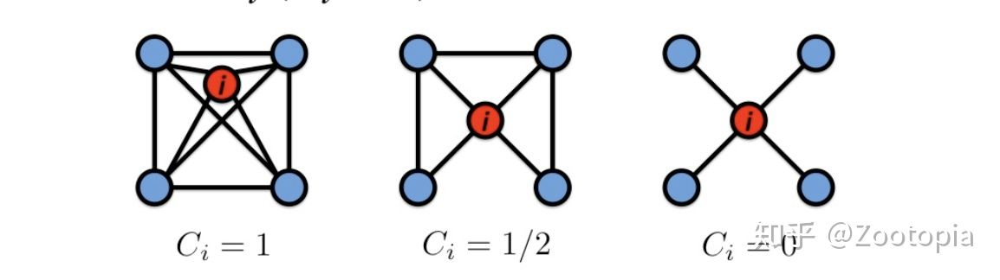

```text
我是节点i，case 1:我的朋友们互相是know each other，那么系数C_i=1
         case 2:我的朋友们一部分相互认识，一部分毫无联系
         case 3:朋友们只和我认识，他们互不认识，这时候系数是0
```

注意：clustering coefficient是对每一个节点都设置的，计算公式是

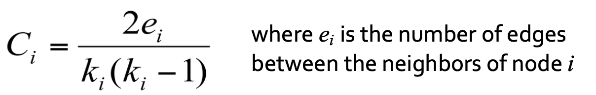

## 下面将这些度量性质用于真实networks

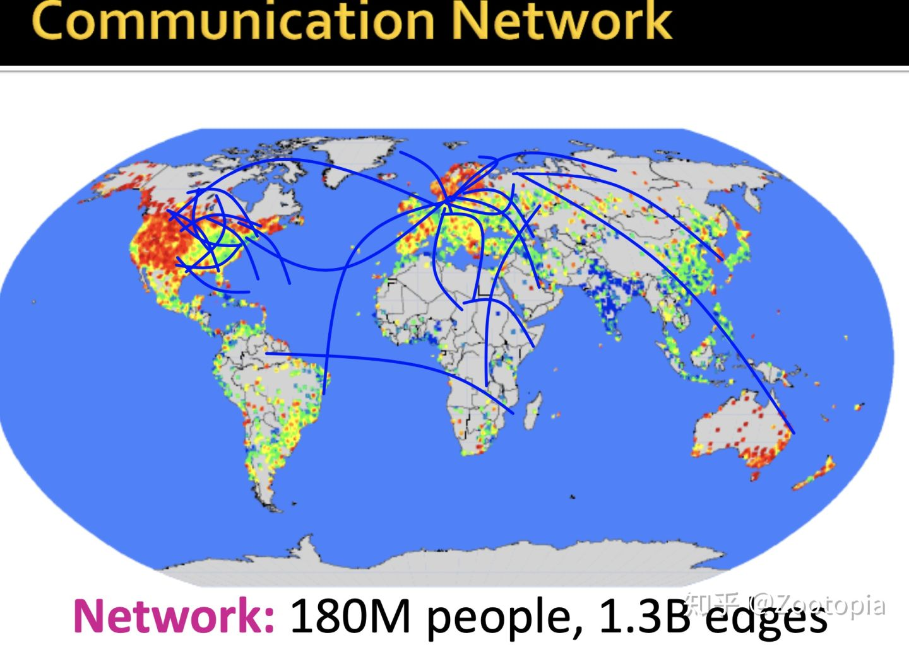思考问题：这些people是怎么联系each other？

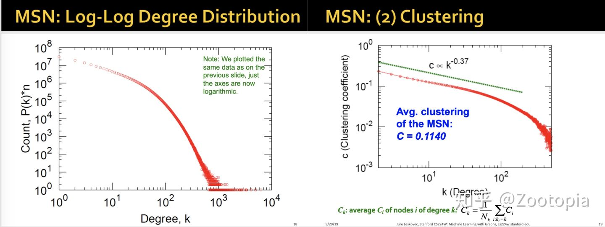

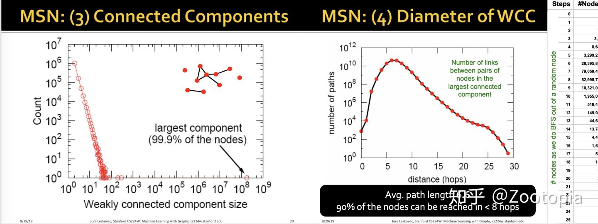

我们从diameter这个图可以看到，基本大部分人互相之间联系在“5”左右

```text
平均路径长度是6.6，这和社会学中常说的每两个人之间只需要7个人即可相互
联系吻合
```

我们根据上面定义的图的一些属性得到的数据总结如下：

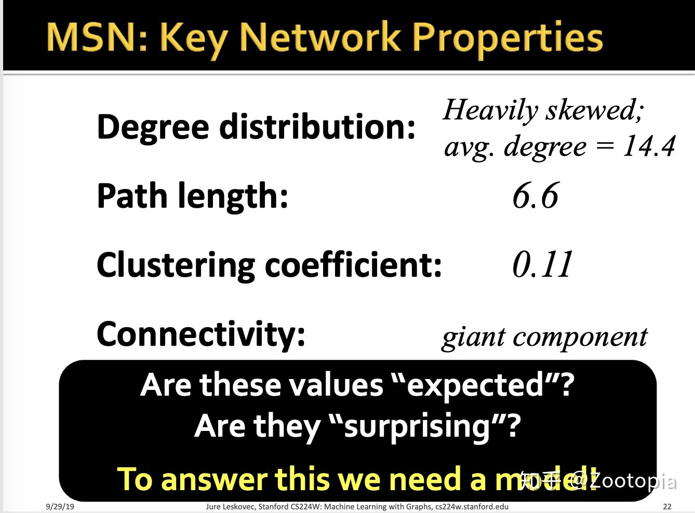

从这些数据中我们可以学到什么？先看另一个例子

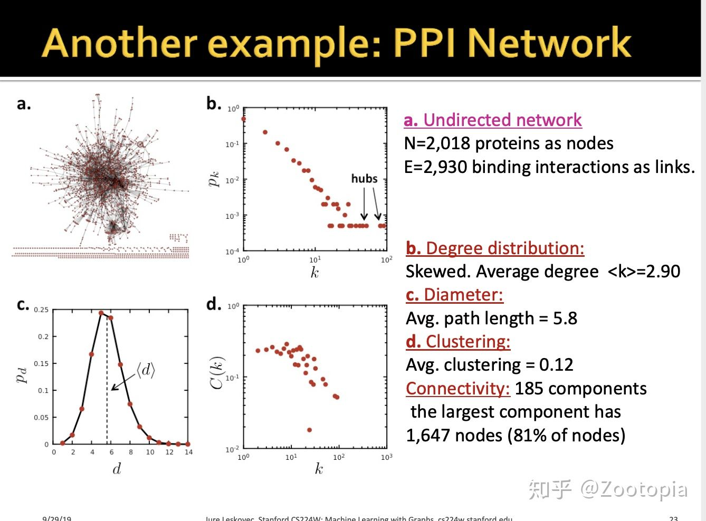

根据这个例子我们再次计算上面的那些属性：我们发现这些属性的数值和上一个例子是**较为接近的**

**既然如此，那么根据具体的例子得到的属性，我们可以考虑其共性，建立我们需要的模型**

**所以下面我们需要考虑的就是一般的图模型的性质**

## random graph model

前面介绍了用来衡量一个图模型的几个主要属性，并且应用于实际中：msn人际关系图和PPI网络之后发现一些属性的值很接近

```text
特殊->一般->建立模型
```

那么现在考虑一般情况下的模型：考虑最简单的图模型

【注意这里考虑的是**无向图**】我们用G_{np}来表示具有n个节点且每个边(u,v)都是服从概率p的独立同分布的无向图

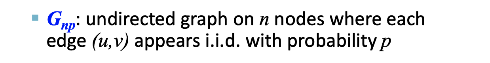

【**注意】n和p不能唯一决定图模型！**

```text
也就是说图其实是随机过程的一个结果，下图是给定n,p值的一个例子
```

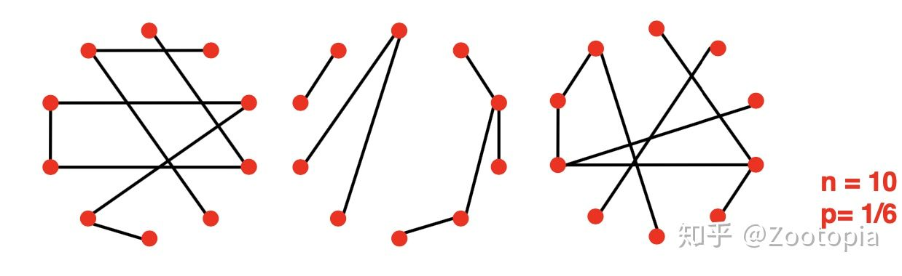

那么现在对于这么general的一个图，我们来看看前面提到的那些属性的值是多少

（1）度分布（degree distribution)

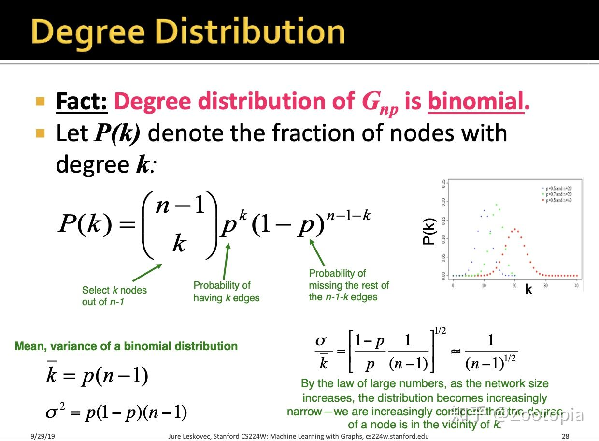

- P(k)：选定了一个节点，于是图中剩下n-1个节点，从剩下的节点中选取k个节点乘以这k个节点有k个边（也就是度为k）的概率
- 有了度分布，可以发现其是**二项式的**
- 既然是二项式的我们就能得到其期望和方差

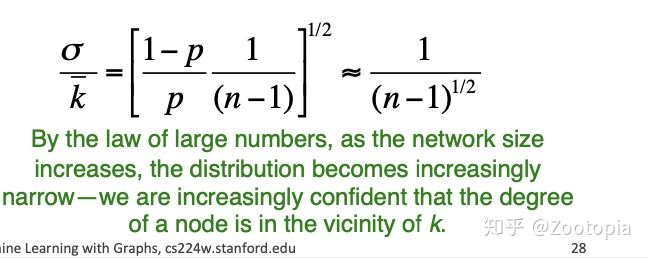

方差和期望的比值说明：当网络规模逐渐变大，平均值会越来越集中

```text
对应了大数定理
```

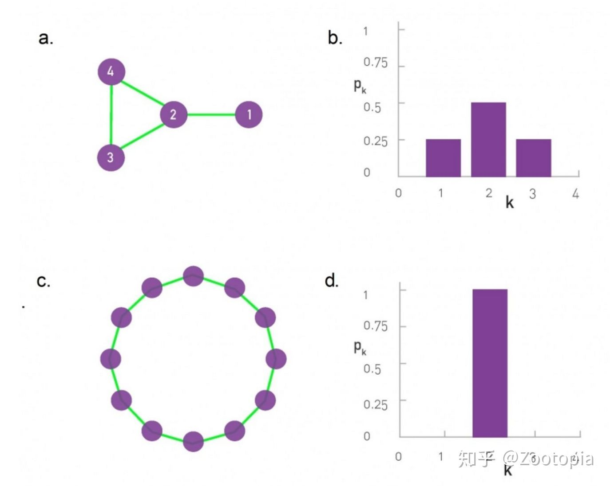


> 补充上一节的一个内容：注意到度的直方图有利于我们判断图的结构

（2）聚合系数

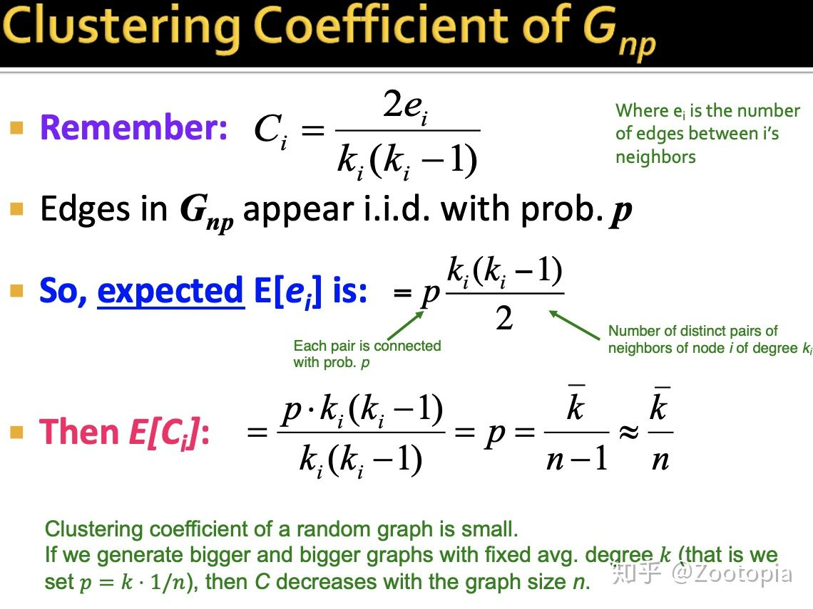

这里的计算比较显然，但是注意到E[Ci]可以发现当期望是一个固定值时，随着图规模越来越大，随机图的聚合系数会趋近于0。

【**下面的学习部分，需要记住随机图的聚合系数是p】**

讨论完了度分布和聚合系数，下面来看随机图的路径长度，这里通过“扩展(expansion）“来衡量

（3）expansion

什么是扩展数？

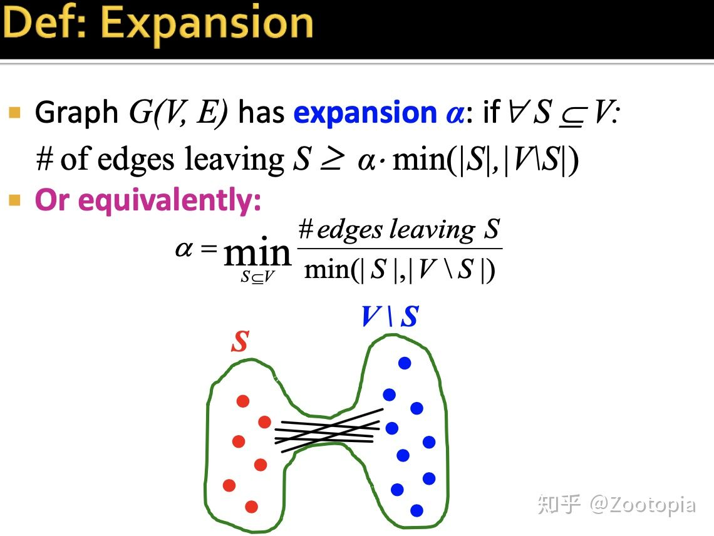

简单理解为：**任取图中节点的一个子集，相对应的从子集中离开的（也就是和这些节点相关的）最小节点数目**

或者还可以理解为：为了让图中一些节点不具备连接性，需要cut掉图中至少多少条边？

（answer：需要至少cut掉alpha Num(节点）条edges）

扩展数alpha也是一个用来衡量鲁棒性的一个度量

（4）largest connected component（最大连接元）

什么是最大连接元？我们看下面这个图就一目了然

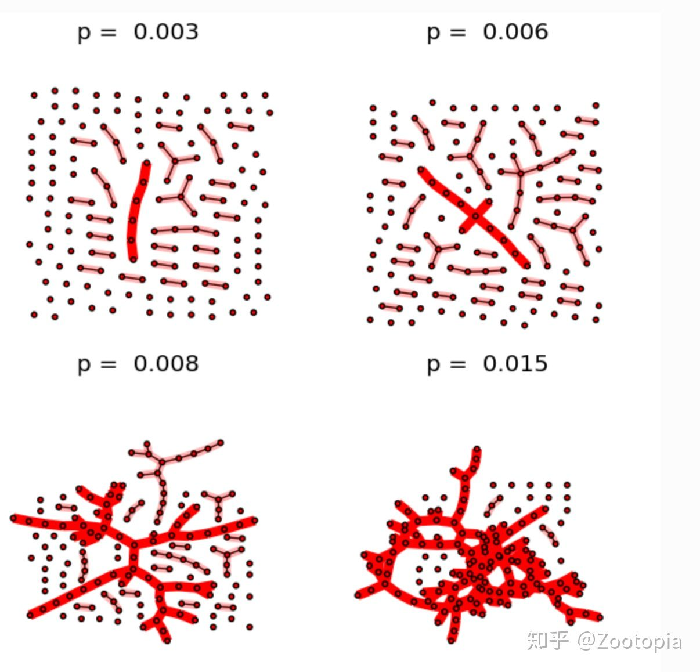图中标红的部分就是最大连接元：连接最多节点的部分

最大连接元的用途/意义： **展示随机图的“进化”过程**

当聚合系数=0的时候：也就是没有edge，这时候是一个空图

当聚合系数=1度时候：就是一个“全连接”的图

那么当聚合系数从0变化到1的过程中发生了什么变化？【当平均度=1的时候，因为k=p(n-1),此时聚合系数c=p=1/（n-1），出现了一个大连接元，以此类推】

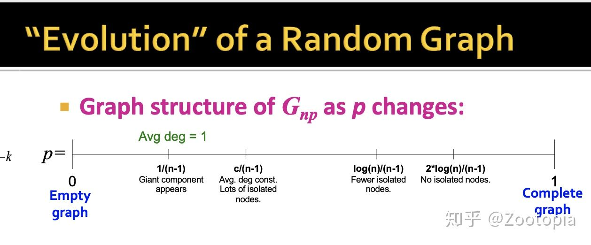

学习完了随机图中的四个重要属性，下面来看随机图的应用性如何，看看和MSN数据的对比

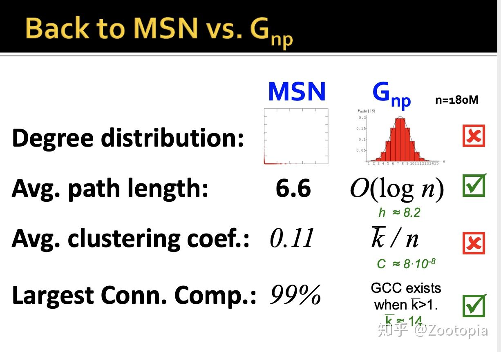

- 之前说过度分布的直方图有利于判断图的结构，MSN和随机图的直方图差距还是很大的；
- 平均路径：MSN和随机图的数据差不多
- 平均聚合系数：差距很大，随机图的非常小
- 最大连接元：很接近

**综上来看，随机图的实际应用性如何？----不好！**

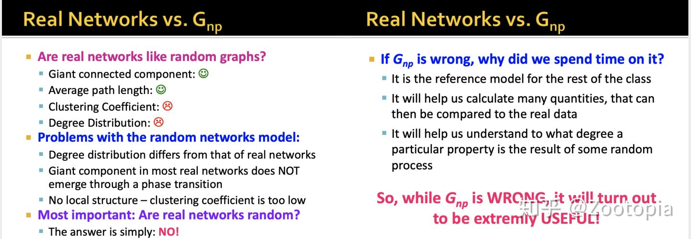

从上面的属性比较可以看出：实际上的网络并不是随机的。

那么问题来了，既然如此又为什么要学习随机图呢？**因为这是最简单也是最有效的学习和评估网络的方法！**

> **随机性包罗万象，我们可以根据实际网络的特性来修改随机图来适应实际网络的需要**

**那么，如何让随机图实际应用性变强呢？**

未完待续......

# part 2

前面介绍了用来衡量一个图模型的几个主要属性，并且应用于实际中：msn人际关系图和PPI网络之后发现一些属性的值很接近

```text
特殊->一般->建立模型
```

那么现在考虑一般情况下的模型：考虑最简单的图模型

【注意这里考虑的是**无向图**】我们用G_{np}来表示具有n个节点且每个边(u,v)都是服从概率p的独立同分布的无向图


【**注意】n和p不能唯一决定图模型！**

```text
也就是说图其实是随机过程的一个结果，下图是给定n,p值的一个例子
```


那么现在对于这么general的一个图，我们来看看前面提到的那些属性的值是多少

（1）度分布（degree distribution)


- P(k)：选定了一个节点，于是图中剩下n-1个节点，从剩下的节点中选取k个节点乘以这k个节点有k个边（也就是度为k）的概率
- 有了度分布，可以发现其是**二项式的**
- 既然是二项式的我们就能得到其期望和方差


方差和期望的比值说明：当网络规模逐渐变大，平均值会越来越集中

```text
对应了大数定理
```


> 补充上一节的一个内容：注意到度的直方图有利于我们判断图的结构

（2）聚合系数


这里的计算比较显然，但是注意到E[Ci]可以发现当期望是一个固定值时，随着图规模越来越大，随机图的聚合系数会趋近于0。

【**下面的学习部分，需要记住随机图的聚合系数是p】**

讨论完了度分布和聚合系数，下面来看随机图的路径长度，这里通过“扩展(expansion）“来衡量

（3）expansion

什么是扩展数？


简单理解为：**任取图中节点的一个子集，相对应的从子集中离开的（也就是和这些节点相关的）最小节点数目**

或者还可以理解为：为了让图中一些节点不具备连接性，需要cut掉图中至少多少条边？

（answer：需要至少cut掉alpha Num(节点）条edges）

扩展数alpha也是一个用来衡量鲁棒性的一个度量

（4）largest connected component（最大连接元）

什么是最大连接元？我们看下面这个图就一目了然

图中标红的部分就是最大连接元：连接最多节点的部分

图来源：

[https://networkx.github.io/documentation/networkx-1.9/examples/drawing/giant_component.htmlnetworkx.github.io](https://link.zhihu.com/?target=https%3A//networkx.github.io/documentation/networkx-1.9/examples/drawing/giant_component.html)

最大连接元的用途/意义： **展示随机图的“进化”过程**

当聚合系数=0的时候：也就是没有edge，这时候是一个空图

当聚合系数=1度时候：就是一个“全连接”的图

那么当聚合系数从0变化到1的过程中发生了什么变化？【当平均度=1的时候，因为k=p(n-1),此时聚合系数c=p=1/（n-1），出现了一个大连接元，以此类推】


学习完了随机图中的四个重要属性，下面来看随机图的应用性如何，看看和MSN数据的对比


- 之前说过度分布的直方图有利于判断图的结构，MSN和随机图的直方图差距还是很大的；
- 平均路径：MSN和随机图的数据差不多
- 平均聚合系数：差距很大，随机图的非常小
- 最大连接元：很接近

**综上来看，随机图的实际应用性如何？----不好！**


从上面的属性比较可以看出：实际上的网络并不是随机的。

那么问题来了，既然如此又为什么要学习随机图呢？**因为这是最简单也是最有效的学习和评估网络的方法！**

> **随机性包罗万象，我们可以根据实际网络的特性来修改随机图来适应实际网络的需要**

**那么，如何让随机图实际应用性变强呢？**

上一节说了随机图和实际网络还是有差距的：主要体现在聚合系数和度分布不一样

那么能不能对随机图进行一定的修改，使得重要的度量能和实际网络对应上呢？那么就要介绍这部分的主要内容：small-world model（我暂且翻译为小世界模型吧）

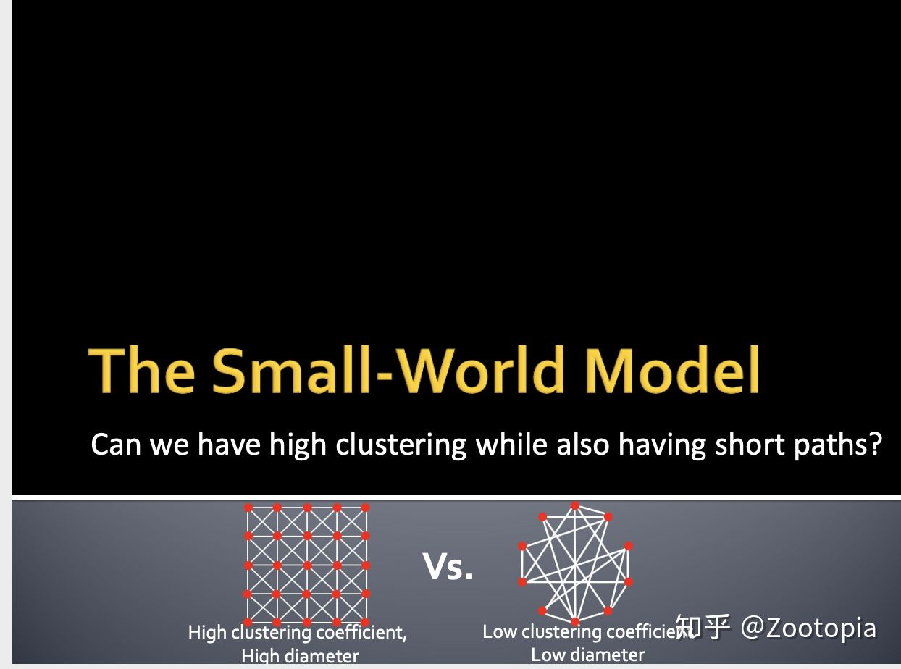

随机图的聚合系数很小，直径很大。这才是和真实网络最大的差异之处。所以能不能有【高聚合系数+小直径】？首先来分析聚合系数反应的本质是什么。

**【高聚合系数反映了局部性】**简单来说就是：社交网络中，我的朋友们互相也是认识的，如同下图

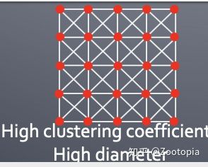

聚合系数和直径之间有一个矛盾之处在于：图的扩展（expansion）会使得保持度不变的情况下，直径越小也会导致聚合系数越小；而高聚合系数（高度连接的网络）却往往直径很大。那么怎么解决这个矛盾？基于以下两个思想：

**（1）聚合反应局部性** 
**（2）随机性可以使得“捷径“出现**

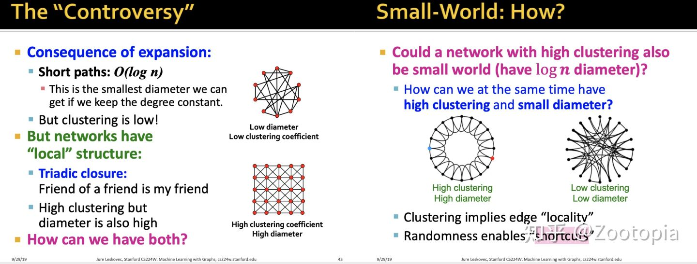

解决方案如下：

**STEP 1：选择高聚合的网络**

**STEP 2：对每个边，以概率p修改边的终点（引入捷径）**

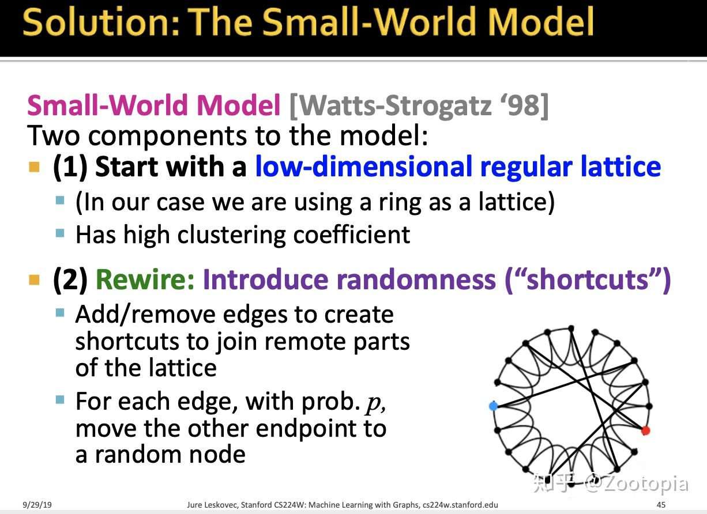

> 这个“捷径”的方法很类似于数值计算中的“插值”：把节点作为插值节点，那么这里修改过的边就类似”线性插值“

从图上可以看出来，想要随机创造捷径是很简单不费力的。

反过来思考：聚合系数呢？社交网络中，我的朋友们互相也认识，所以聚合系数高，可是很难让我的朋友们互相“绝交”从而让聚合系数降下来。下图可以反应这个现象

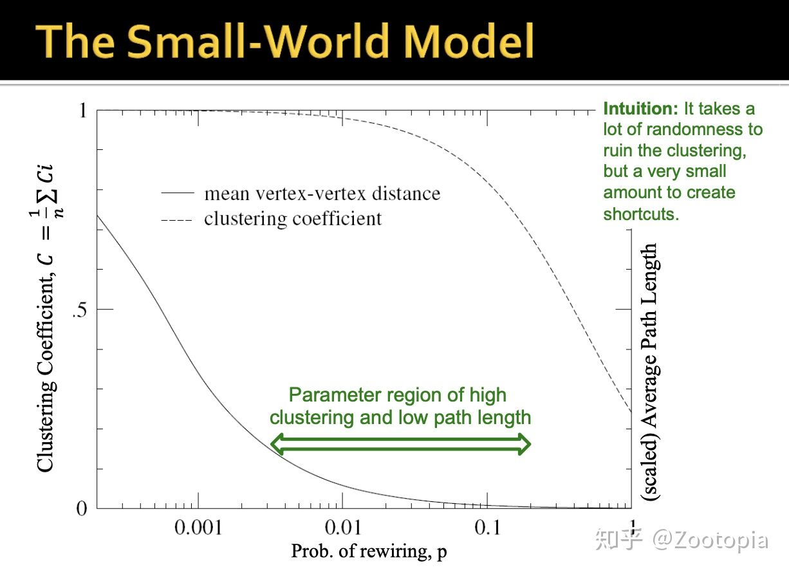横坐标是修改原有图的边位置的概率，纵坐标是聚合系数

从图中可以看到“高聚合系数+低路径长度”的区域是很大的

既然已经解决了随机图和实际网络的"gap“，那么现在我们看看这个被修改了的随机图，表示的是什么？

```text
（1）高聚合系数：我的大部分朋友们互相都认识
（2）低直径：但是我也有几个朋友在另一个城市，且他们和其他朋友互不认识
```

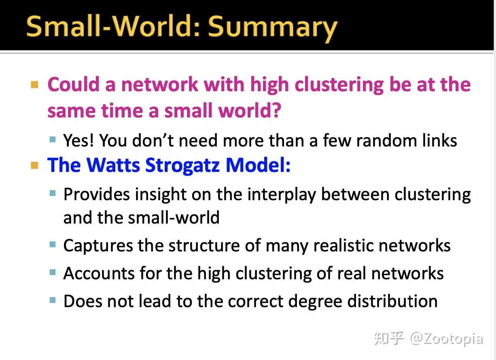实际网络这样的情况还是很多的

第二节课的最后一部分：Kronecker图模型

[[CS224W\] 图机器学习 Machine Learning with Graphs (Stanford / Fall 2019)_哔哩哔哩 (゜-゜)つロ 干杯~-bilibiliwww.bilibili.com](https://link.zhihu.com/?target=https%3A//www.bilibili.com/video/av84385561%3Fp%3D2)

前面一直都是在讨论随机图，上一节还说到通过对随机图引入随机“捷径”可以将随机图变为small-world model，那么这部分来讲讲如何生成大的真实图。

首先开门见山介绍背后的idea：就是**递归（循环）图生成**

*基于现实观察：自相似性*

```text
比如不同的friendship的建立往往基于相同的文化、相似的爱好等等
```

很多物体和本身的一部分是很类似的，那么利用这个思想，可以给定初始的小的图，从而对其进行不断的扩张得到递归图

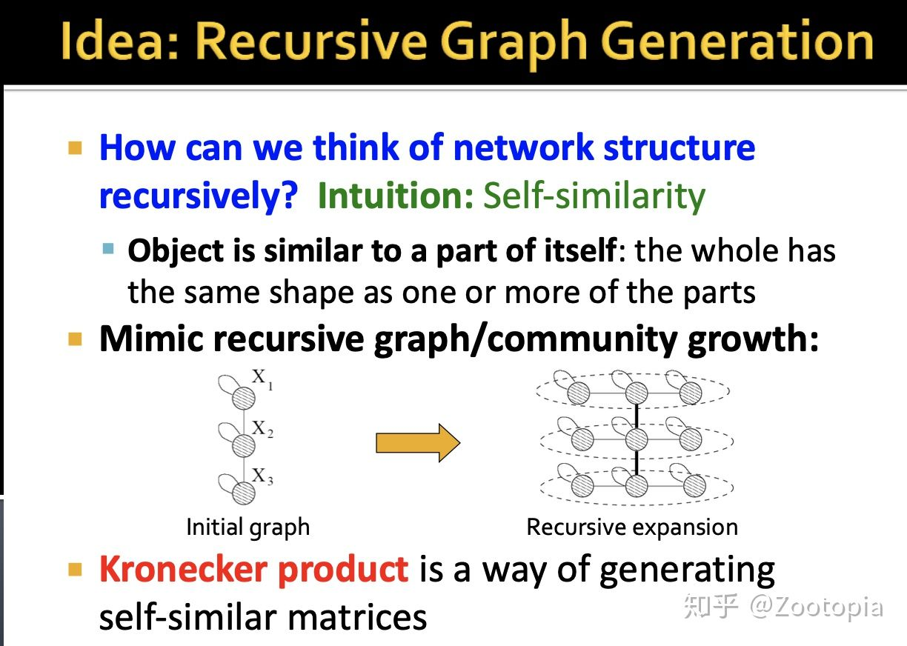

那么这个思想基于的**工具是：kronecker积**--定义如下

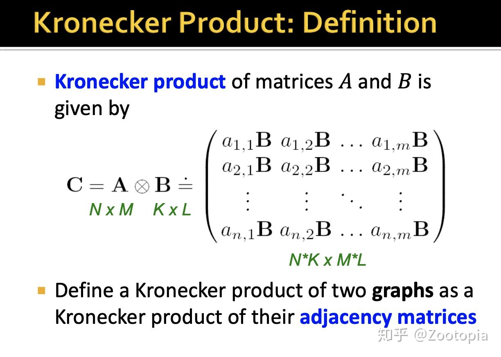

这个积的定义基本上大家在很多数学书上都有看到，这个积的结果是明显放大了原有的矩阵的阶。那么对于在图中的推广就是利用**图的邻近矩阵来做kronecker积**

**那么什么是kronecker 图？--初始图（初始邻近矩阵）的循环kronecker积**

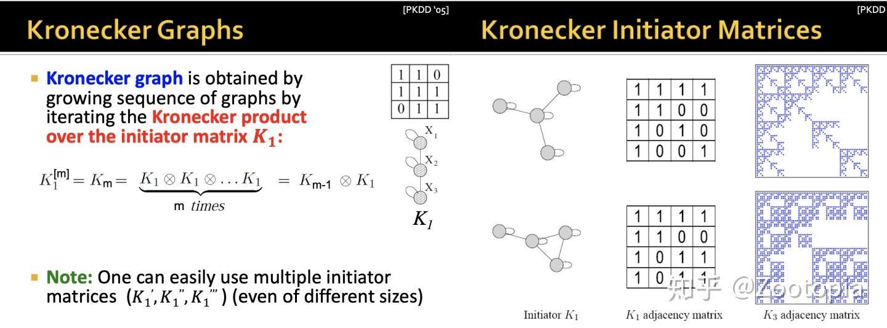

这样的方法即自然又简单，但是呢，我们观察下面这个图

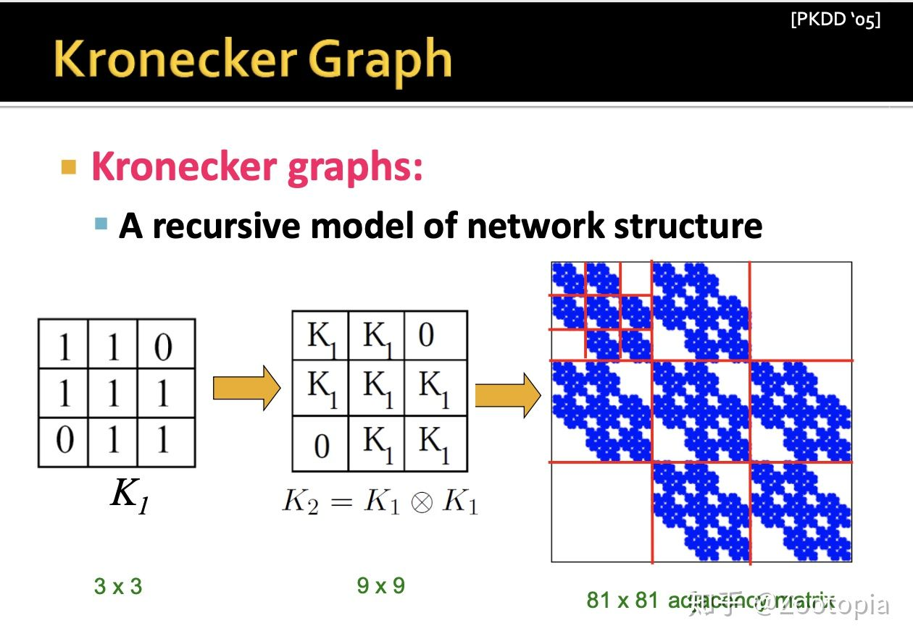

尽管到目前为止讨论的Kronecker结构产生的图具有一系列所需的特性，但其离散性质在程度和频谱数量上会产生“阶梯效应”，这仅仅是因为单个值具有较大的多重性。例如，图邻接矩阵的特征值的度分布和分布以及主要特征向量分量的分布（即“网络”值）都受此影响。这些数量是多重分布的，这导致具有多个重复的单个值。下图说明了阶梯效应（这部分来自lecture讲解人的论文[https://dl.acm.org/doi/10.5555/1756006.1756039](https://link.zhihu.com/?target=https%3A//dl.acm.org/doi/10.5555/1756006.1756039)

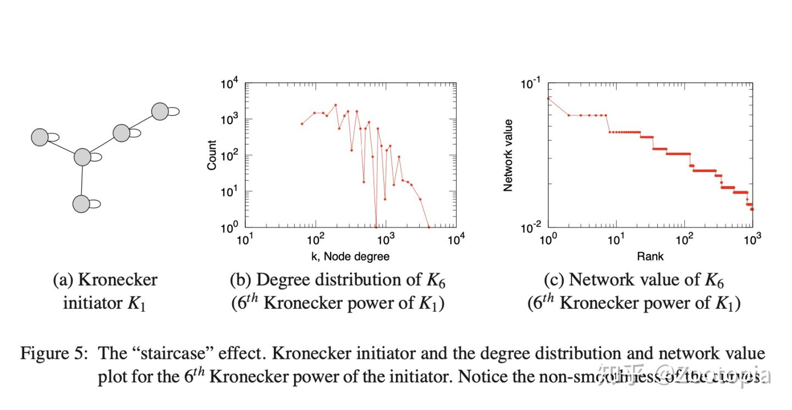

```text
会发现得到的图邻近矩阵的结构是很规则的（因为邻近矩阵的元素都是1或者0），
类似于具有规则结构的网格一样，这样的当然好（利于我们分析），
可是这样的图结构就很难capture真实复杂网络的信息了，那么要怎么办？-----答案是引入随机性！
```

这里在初始矩阵引入随机性的意思是：放松初始矩阵--邻近矩阵只有0或者1元素的条件，而是可以有[0,1]之间的元素，也就是

（1）初始矩阵的每个元素反应的是特定边出现的概率

（2）对初始矩阵进行Kronecker积运算，以获得较大的随机邻接矩阵，在该矩阵中，大型矩阵的每个元素数值再次给出了特定边出现在大图中的概率，**这样的随机邻接矩阵定义了所有图的概率分布**

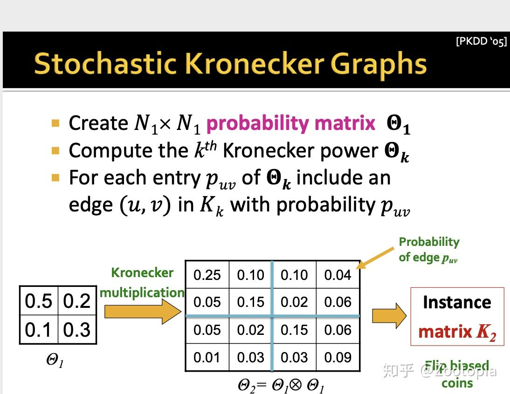


那么这个方法存在一个缺陷：费时间！

所以下面给出了一种快速方法---基于的思想：还是**kronecker积的本质--循环性**


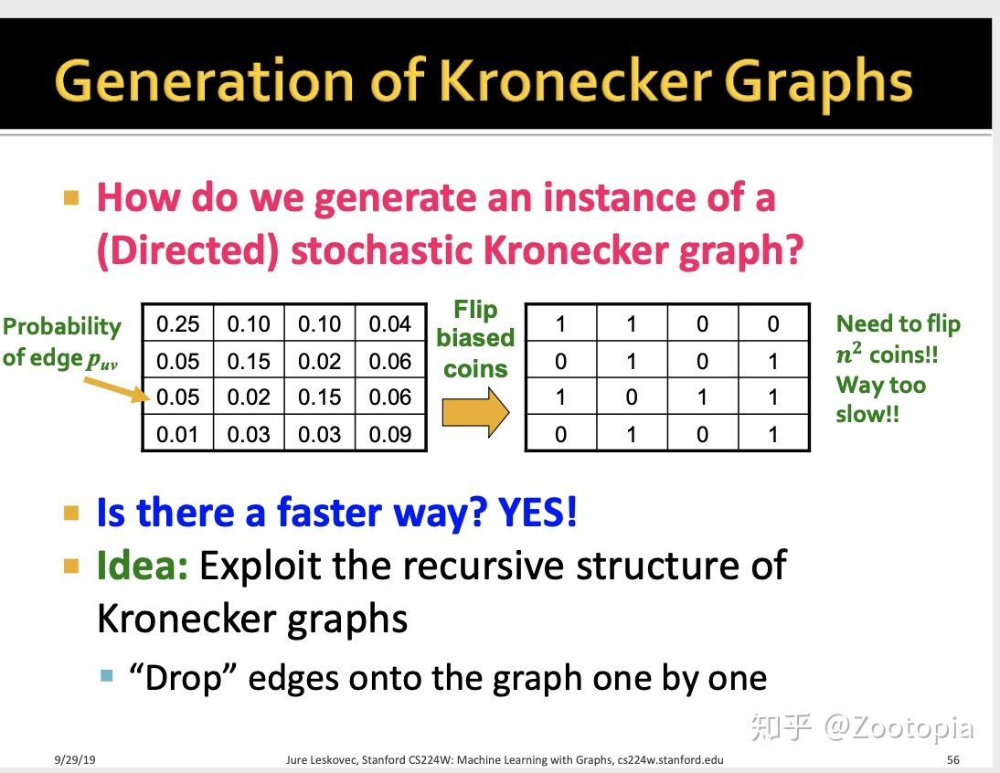

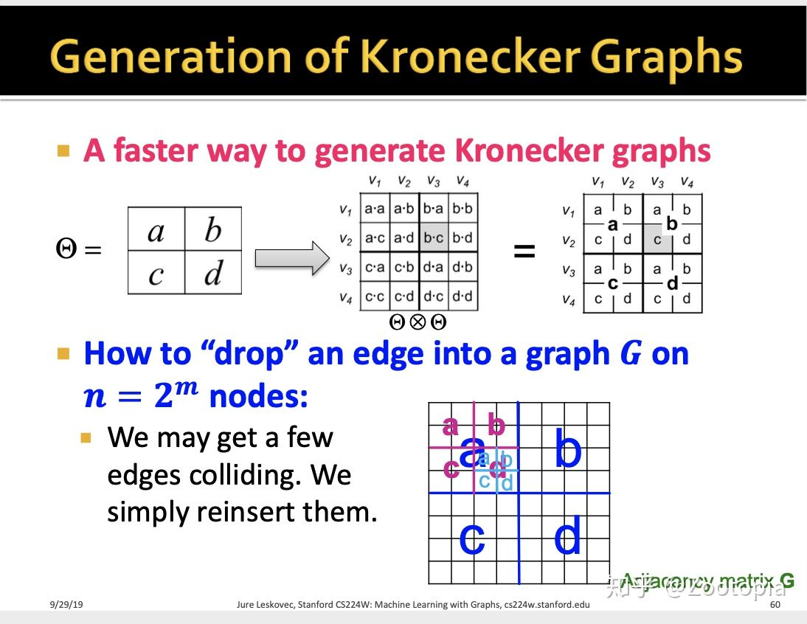

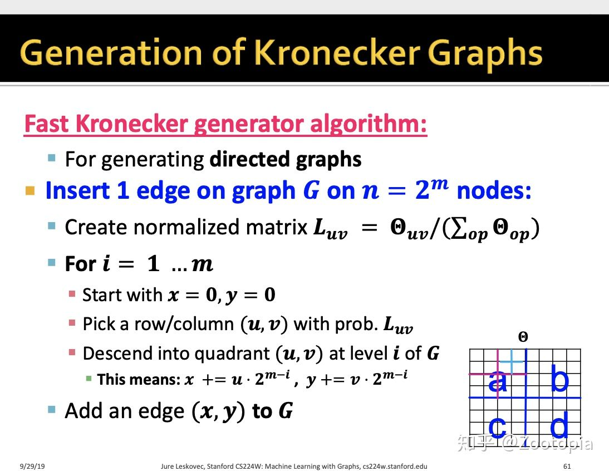

**总结一下**：随机kronerker图从数学上用公式来表示就是

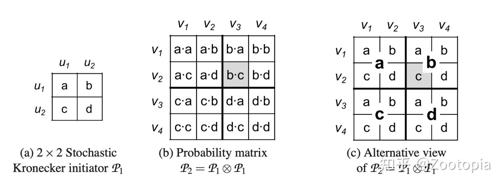


这给了我们对随机Kronecker图的非常自然的解释：*每个节点由一系列分类属性值或特征来描述。然后，两个节点链接的可能性取决于各个属性相似性的乘积。*

