这部分开始讲网络中的模块(motifs)和结构性角色，首先介绍模块。

在此课之前有一个实践课，关于snappy的用途，具体参照以下这个文件就讲述的很详细了

[http://web.stanford.edu/class/cs224w/slides/CS224W-snappy-tutorial.pdfweb.stanford.edu](https://link.zhihu.com/?target=http%3A//web.stanford.edu/class/cs224w/slides/CS224W-snappy-tutorial.pdf)

- **子网络（用来刻画和区别网络）**

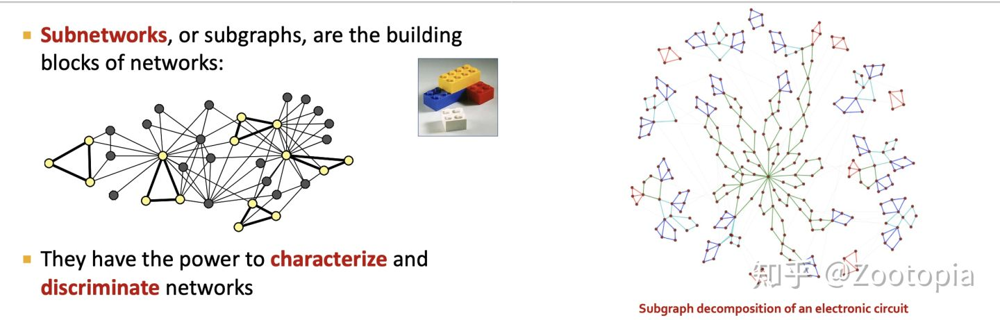

> 从小至大的思想（或者称为分解思想）：
> 较大的问题=若干个小问题之和，
> 较难的问题=若干个简单的子问题之和
> 如同乐高

举个简单例子，当有三个节点的时候，会有以下可能的子图：

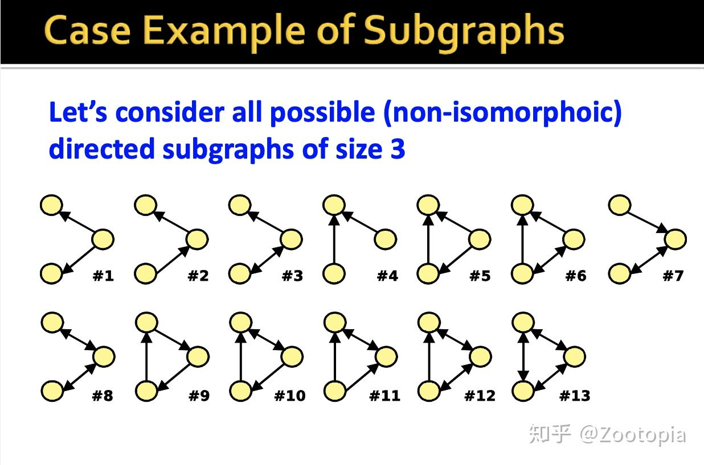这里考虑了有向图

子图的概念是很容易理解，那么我们需要什么样的子图？很自然的想法是--包含能够具有刻画整体图的性质且容易分析

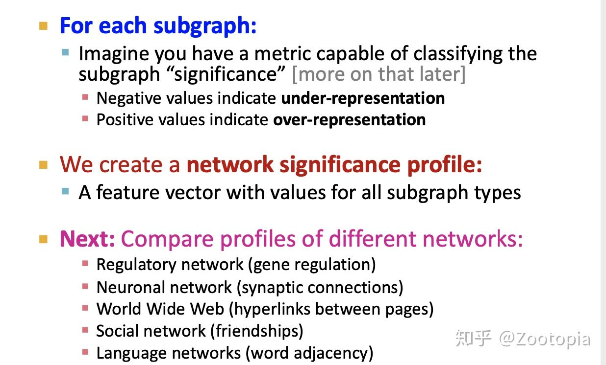

（STEP 1）对于给定degree的所有可能子图，我们需要一个度量能够衡量子图的“重要程度”（正值表示过表示，负值表示欠表示）

> 感觉这里“表示”展现了子图能够反应整体图的一个表示能力（代表性）

（STEP 2）有了这个度量的概念，下面建立一个对所有子图类型的重要程度profile来进行对比

（STEP 3）拿真实的网络来对比不同网络的profile水平

还是前面那个三个节点的例子，下图最下方横坐标表示的是三个节点对应的不同的子图，纵坐标是“重要程度”度量的值，测试了四种不同的网络（每个网络中也选取了不同的case），纵坐标正的值表示过表示，负的对应欠表示


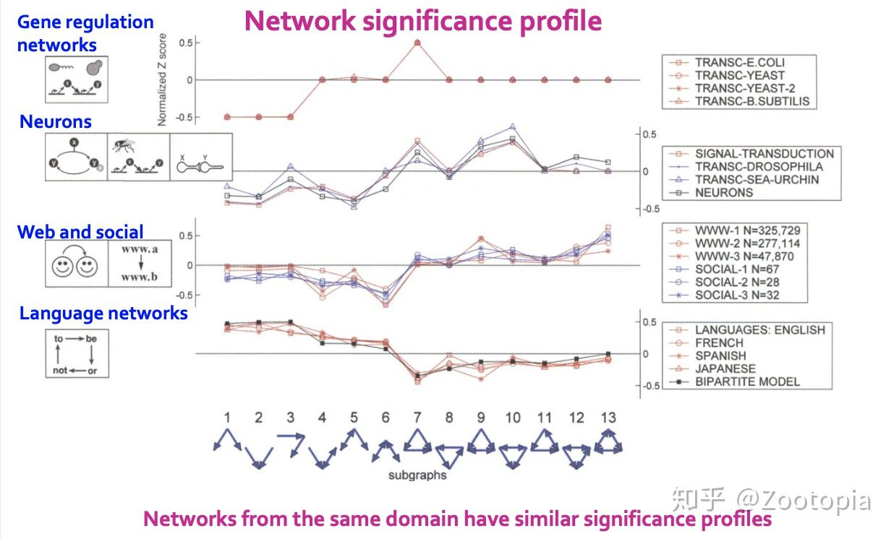

基于这样的步骤，首先来看第一个概念：

## 模块(motif)

**定义：网络模块是指反复出现的重要的连接模式（**recurring, significant patterns of interconnections ）

*这里有几个关键词：模式（pattern)、反复出现(recurring)、重要的(significant)*

*pattern意味着小的诱导的子图--给定了节点，“诱导”表示节点之间的连接都包含在内*

*recurring意味着出现的频率很高*

*significant---相比随机图，出现的频率更高*

> 随机图再次出现
> 后续可以发现随机图给我们
> 研究现实网络提供了
> 一个很好的参照作用

**用途：模块的用途比较显然--（1）弄明白网络如何工作（2）在给定情境下预测网络的操作和反应**

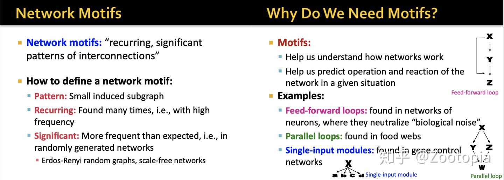

这里值得注意的是，“诱导”包含节点的连接，如下图的例子

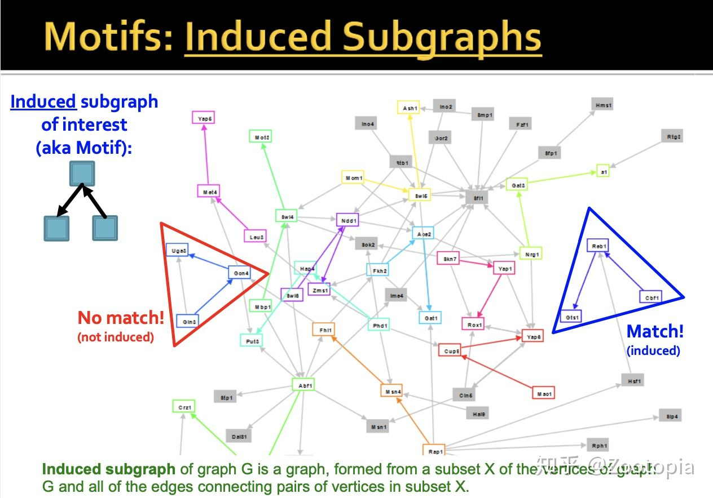

红色的子图不匹配就是因为连接的edges不对。

既然说到significance是通过和随机图的对比来看出现频率的，那么如何转换为数学语言来表示这个significance？

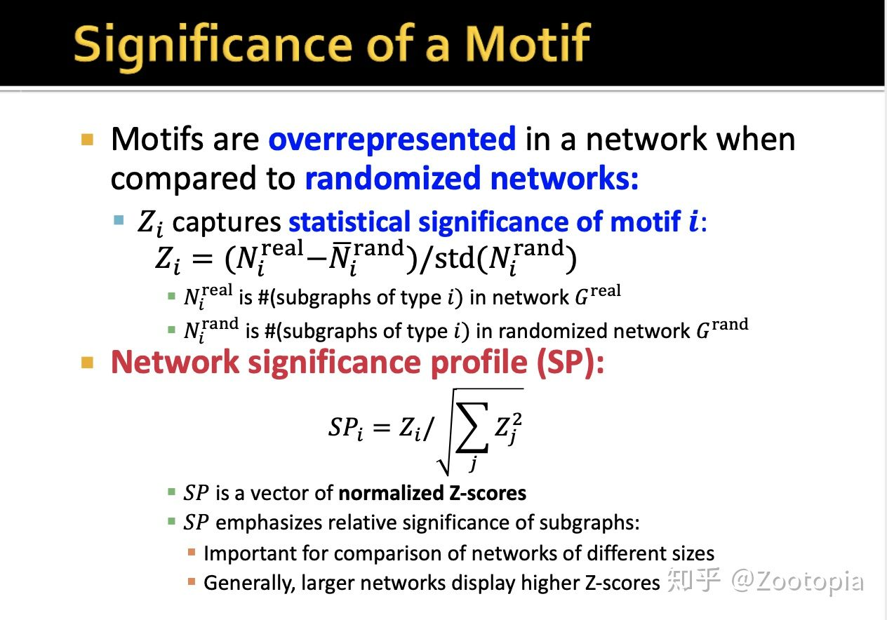

这里用到的是对比同样的子图类型下，真实网络和随机网络的出现次数，并且最后做一个正态化。（如果不对比，仅仅看出现次数，有些网络非常的大且密度很高，可是其实某个子图并不具有代表性，但是因为图过大，所以这个子图出现次数也能有较大的数字，所以还是要和随机图来进行对比，并且要正态化）

有了这个数学计算公式，就可以知道如何衡量子图的significance，那么在给定了degree的时候如何去配置这个用来做对比的随机图呢？

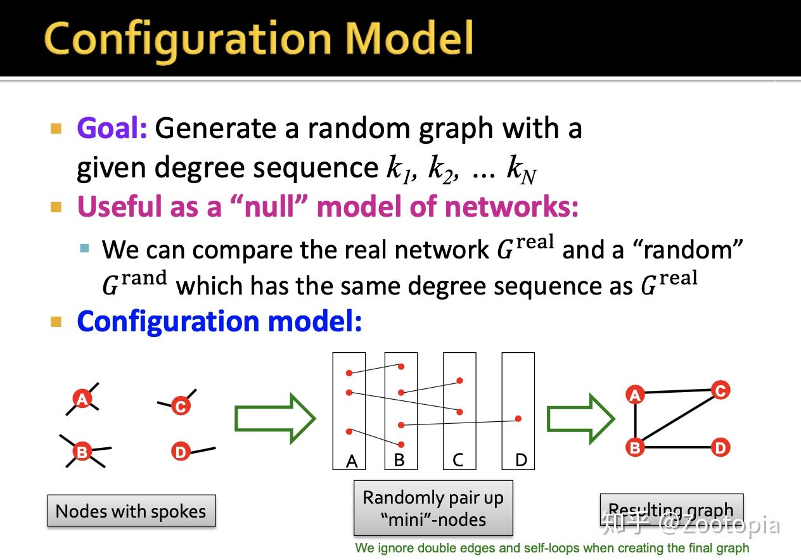

- 给定节点和其“触角”
- 随机配对
- 产生图

【注意】（1）为什么不遍历所有的搭配可能性？--因为那样就失去了**randomness，我们需要的是随机图**

（2）节点B本来有四个“触角”，怎么最后生成的图上只有三个edges？--忽略双边和自环的

# 3.2 

上一节学习到了配置用于对比作用的随机图，还有一种配置方式

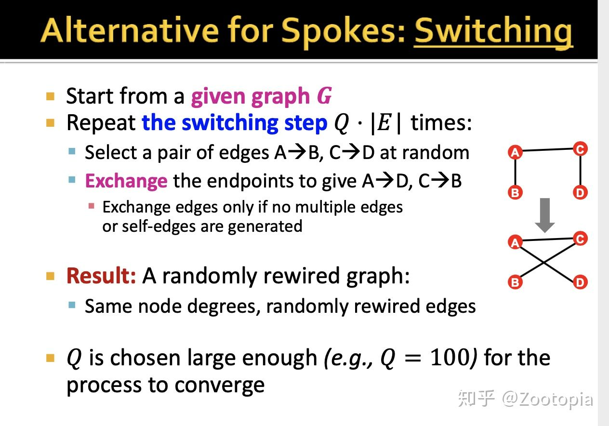

- 从一个给定的初始图开始
- 每一步随机挑选一对edges然后改变edge所对应的终止节点
- 重复下去

比如将

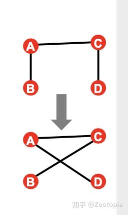

A-B,C-D改为A-D,C-B（**做一个cross）**

> 迭代次数（做cross次数）足够多的话可以保证收敛。
> 整个过程所有节点保持不变的degree，但是图变得越来越random

那么我们怎么确定得到的model是一个足够好的model？--取决于你要做什么。

这里我们kept节点个数、边个数等去match真实网络。

现在我们回顾一下找模块的步骤：

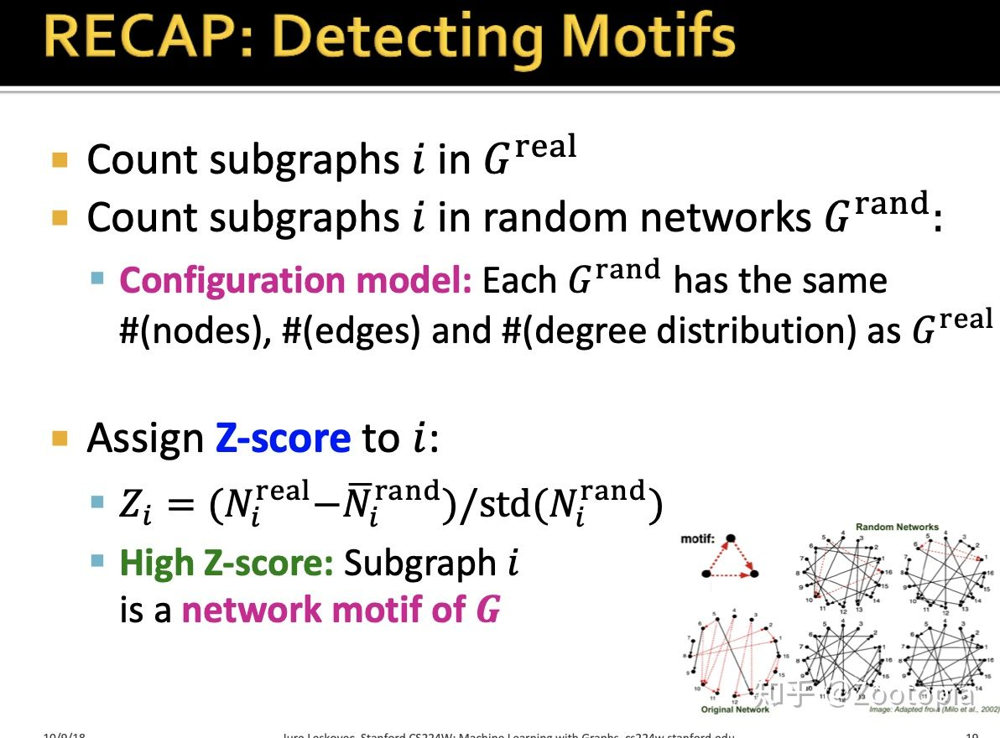

那么需要生成多少个随机图？---基本上是成千上万，甚至更多（也取决于真实图的大小）

当然对于模块的定义和度量形式也有很多其他的表示方式：

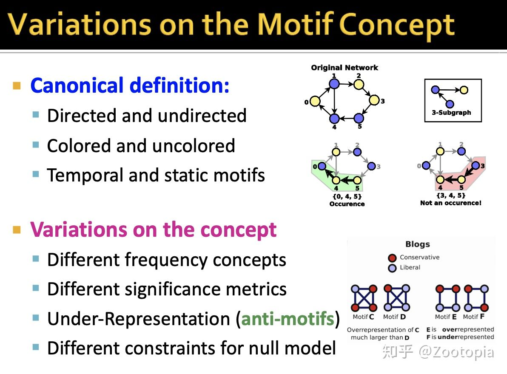

## Graphlet：node feature vectors

前面学习了模块，用来从局部来窥探整个图的结构，在学习整个图的结构之前，我们现在开始看看一个节点周围(neiborhood)网络的结构是什么样的，学习用graphlets来描述节点的特征，描述给定节点周围的网络结构。

什么是graphlet？--**连通的非同构子图**

> 同构图：如果能够通过重新标记图G的顶点而产生图H，则称两个图G和H是同构图
> 可以理解为两个图之间存在双向映射
> 如果两个图是同构的，不取决于两个图是怎么画的，也不取决于如何标记
> 顶点。
> 图G和H是同构的，那么它们的阶相同，大小相同，各顶点度数也对应相同
> -----《图论--一个迷人的世界》
>
> \#可以理解edges是具有弹性的绳子，同构表示，节点固定，对G“扯一扯”绳子即可变换成H#

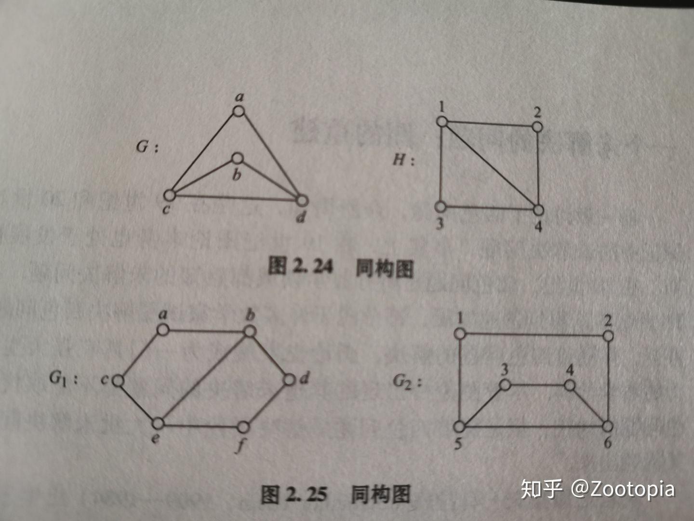

[为什么要判断两个图是否同构?www.zhihu.com](https://www.zhihu.com/question/343456444/answer/807832678)

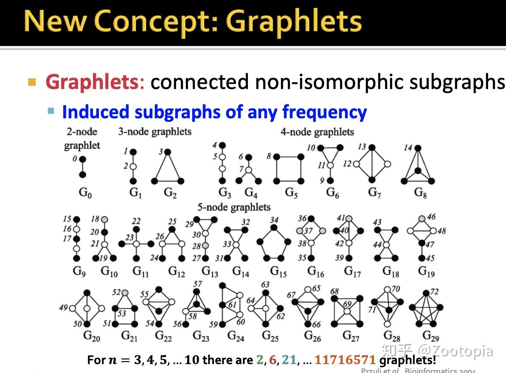

我们用graphlets来作为一个在节点层面的子图度量

我们回顾一下什么是degree

degree是一个节点上的边的个数

现在把degree的概念推广到graphlets上--**graphlet degree vector：一个节点touch的graphlets的个数。**

graphlets考虑的是连通的非同构子图，非同构指的是不同子图之间的关系，但是我们要考虑子图自身的性质--自同构

```text
自同构可以视为图G和G的同构
```

\#最初等的理解：对称#

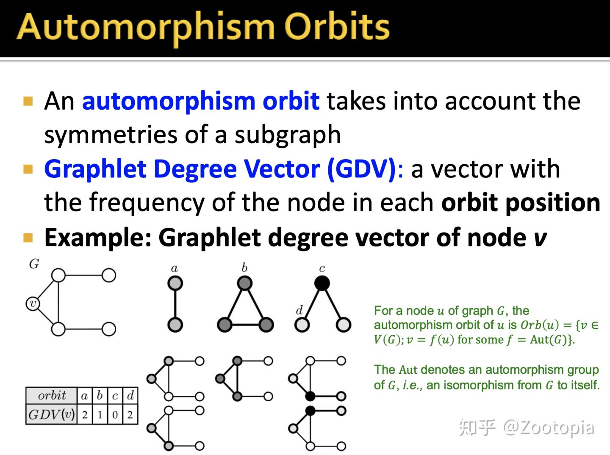

*看上图中给定节点v，v所touch的子图为形式a的有两个，b的有一个，注意到c是0个（因为G中节点之间是连接的，并不像c这样），将v作为d节点的子图有两个*

**所以graphlet度向量表示的是给定节点touch的给定轨迹的子图个数**

## **现在学习如何找motifs和graphlets**

这里涉及两个步骤：（1）列举所有size-k连通的子图 （2）数每一个子图类型出现的次数

```text
look at这两个步骤就可以看出来工作量很大
```

所以基本上**可行的模块(motif)规模是比较小**的：3--8

首先看第一步：列举

这里主要介绍exact subgraph enumeration（参见Wernicke2006的paper）

[http://www.akt.tu-berlin.de/fileadmin/fg34/publications-akt/motifs-tcbb06.pdfwww.akt.tu-berlin.de](https://link.zhihu.com/?target=http%3A//www.akt.tu-berlin.de/fileadmin/fg34/publications-akt/motifs-tcbb06.pdf)

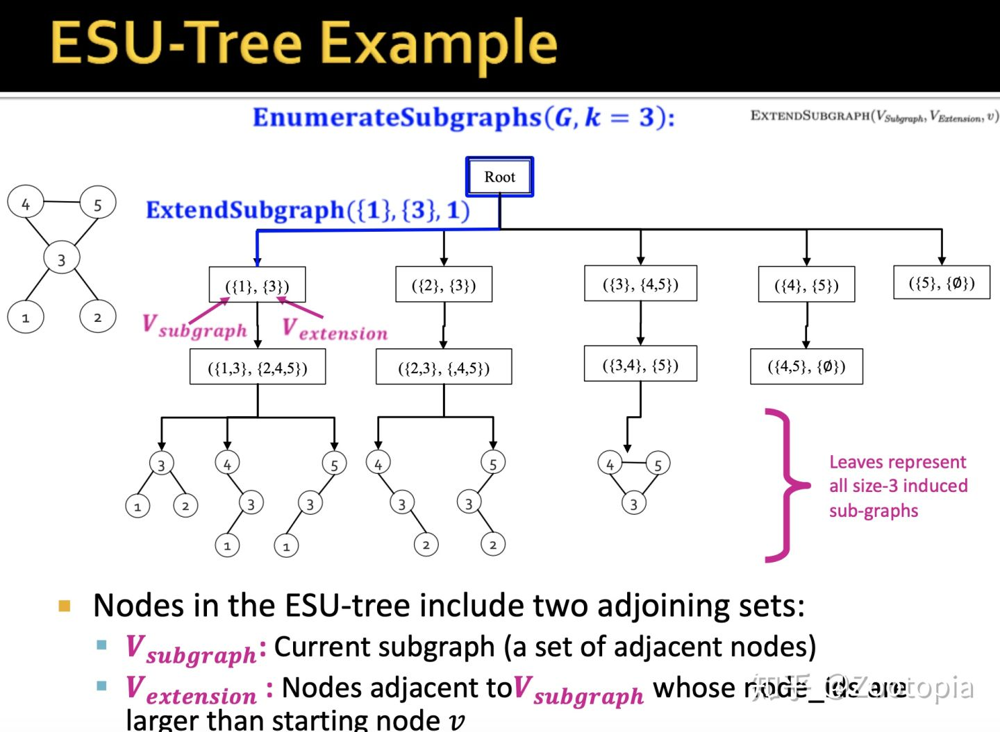ESU的步骤

这张**树结构**图很明了的介绍了esu的思想

完成了第一步：列举，下面就是第二步：数每个类型子图出现次数

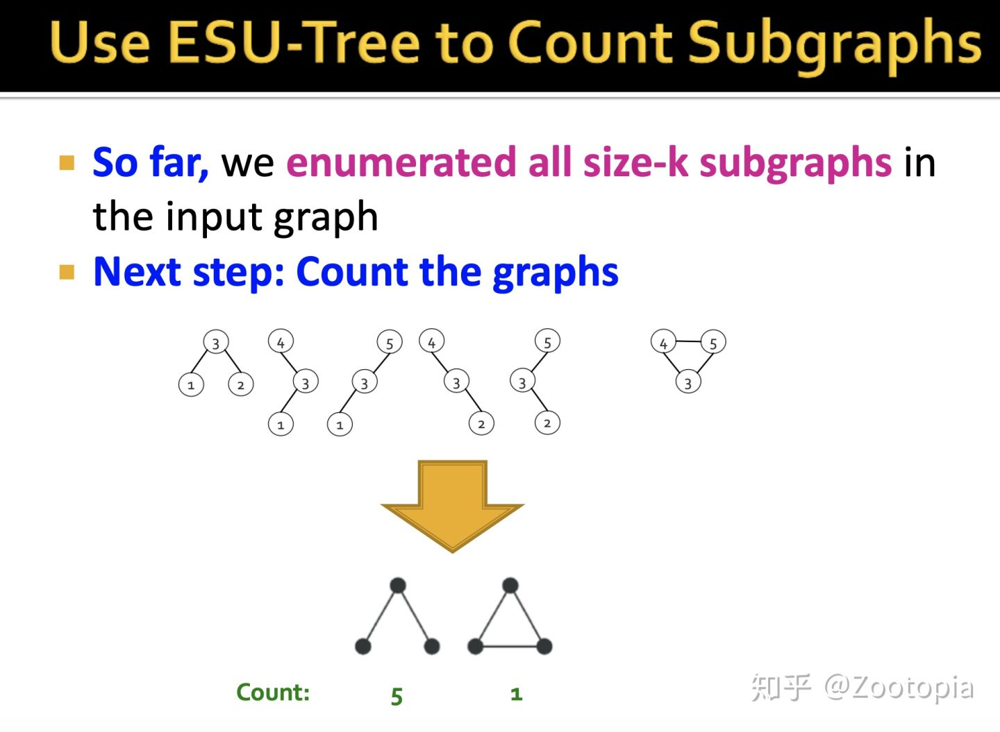

在数个数这一个步骤存在一个问题：如何分类---即要把子图分为不同构的类型（同构的图属于一个类型）---用的是McKay的nauty algorihtm，具体参见以下网站

[The nauty Traces pageusers.cecs.anu.edu.au](https://link.zhihu.com/?target=http%3A//users.cecs.anu.edu.au/~bdm/nauty/)


这节课也提到了同构：

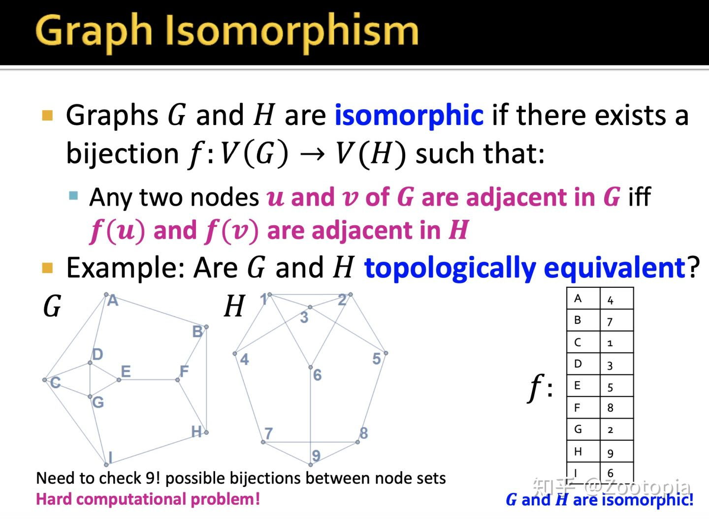

图G和图H是同构的，如果存在双射f，使得在G中相邻的节点在H中也是相邻的。

从定义上看检验两个图是否同构核心在于找到这个映射f，但是实际操作上等于要对每两两节点要去判断，计算量是很大的。

------

## Structural Roles in Networks

这节课的最后一部分：关于roles。

```text
如同在公司里根据每个人的职责和工作性质决定了每个人的角色
那么在网络中也需要根据节点的结构表现来决定其角色（role）
```

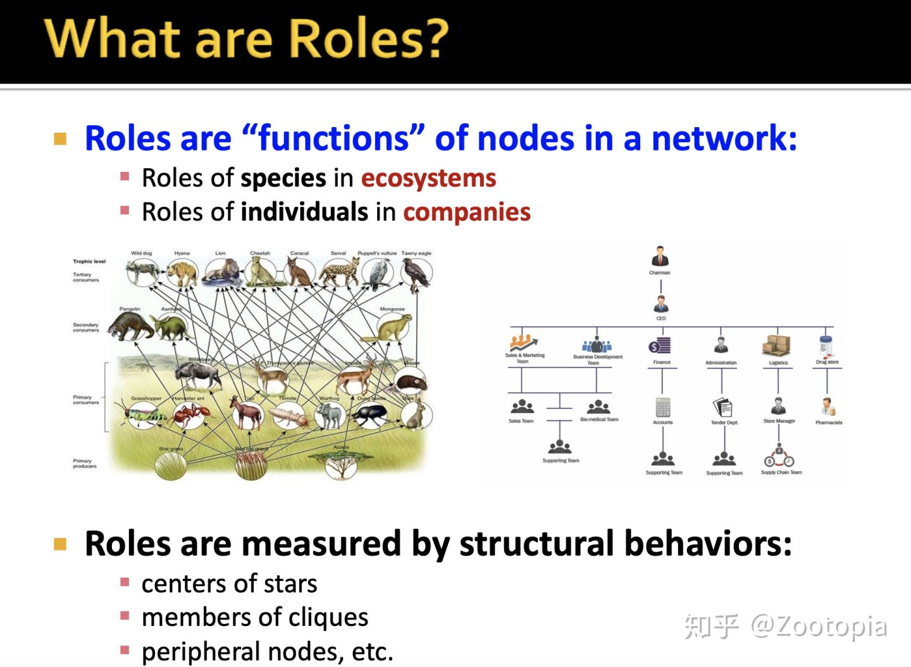

这里要注意区分role（角色）和group的概念：

- role是根据在network中相似的功能来决定：例如公司中作为测试工程师的每个人，因为做着相似的工作所以扮演相同的role，可是在公司这个network中，这些人**不一定互相连接。即role取决于相似性而不是相互连接性**
- group/community则是互相连接的个体（节点），核心在于**连接性**

举个例子：学生、教师这是role，AI实验室、 Info实验室这是group/community

roles和groups是一种互补的概念

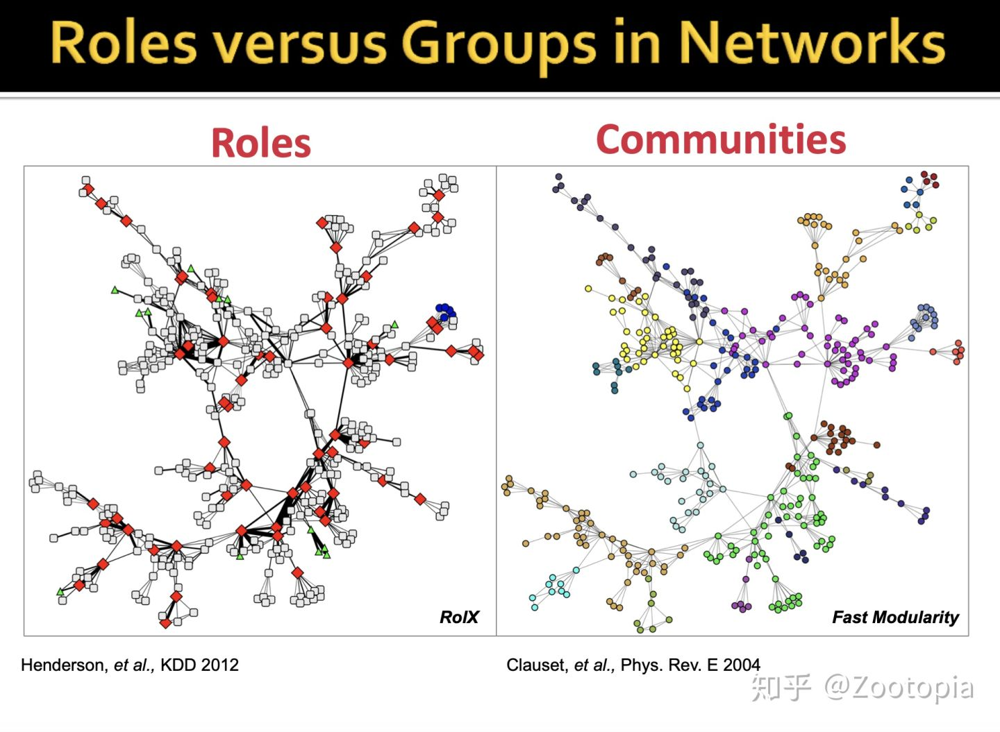

**更正式的描述**

结构等价性（structural equivalence)--两个节点称为结构等价的，如果它们和**所有其他节点**都有着相同的关系

> 这是从社会网络中引用过来的一个概念

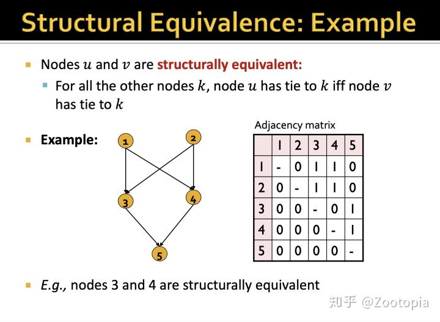

## 发现网络中的结构角色(roles)

为什么roles重要？下图给了很详细的说明

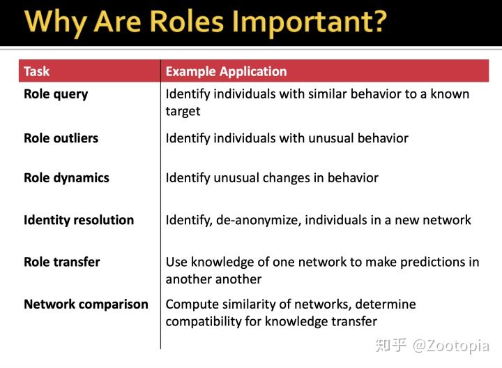

那么怎么去发现网络中的roles？这里介绍RoIX

RoIX是一种无监督学习方式来自动探测网络中节点的结构角色，具备以下优点：

- 无需先验信息
- 给每个节点分配a mixed-membership of roles

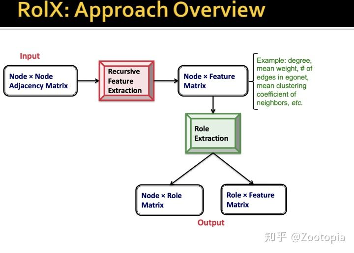

根据上图来分析

*step 1：输入节点信息*

*step 2: 递归特征提取*

*step 3: 得到节点特征矩阵（例如度、平均权重等）*

*step 4: 提取role*

*step 5: 输出节点角色矩阵和角色特征矩阵*

下图展示了输入和输出

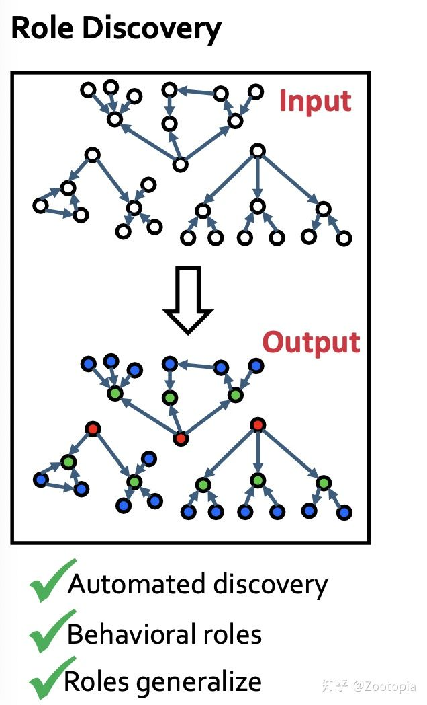

那么要重点讲解的就是第二步的递归特征提取和第四步的角色提取

## （1） 递归特征提取(recursive feature extraction)

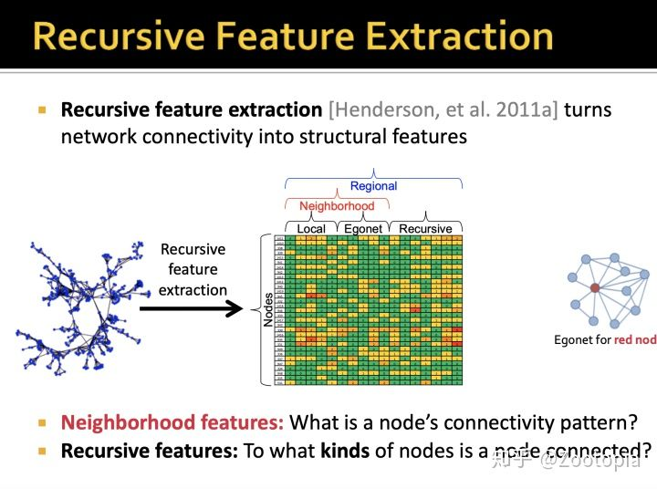

明天继续更....