[TOC]

# Cs224W 8-Graph Neural Network

Graph Neural Network,可能是整个CS224W中大家最关心的一节了.

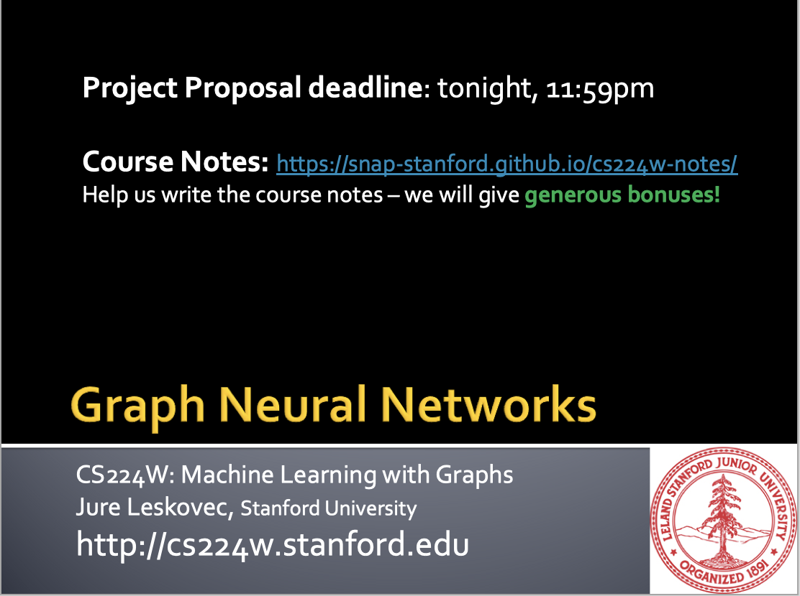

## 节点表示

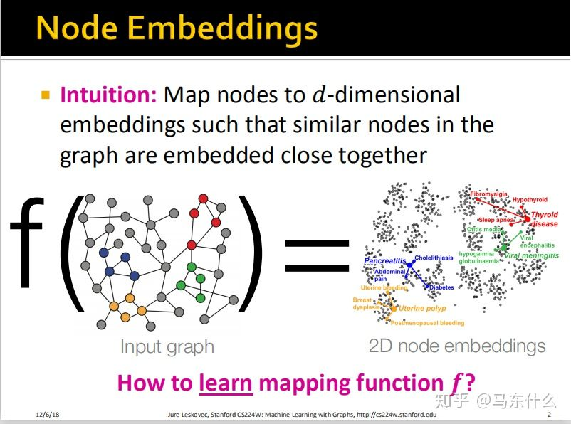

我们的目标：

将节点映射到维度嵌入，使得图中的类似节点紧密嵌入在一起

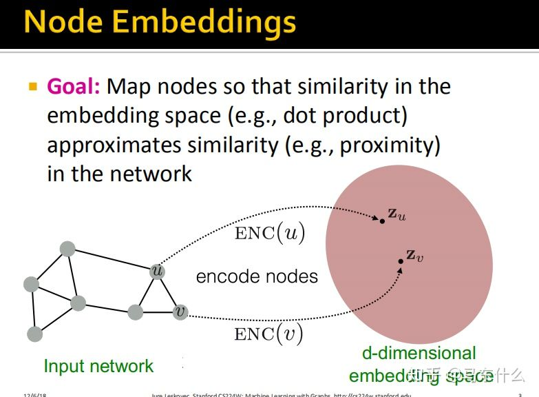

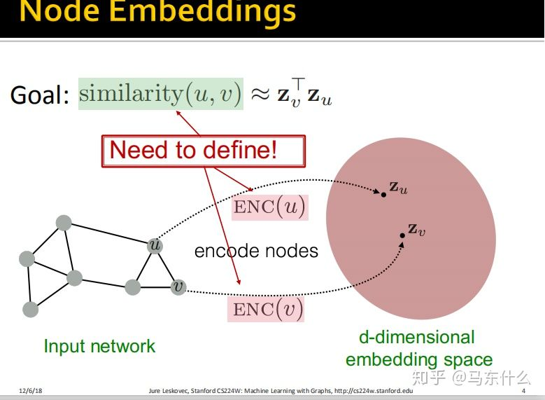

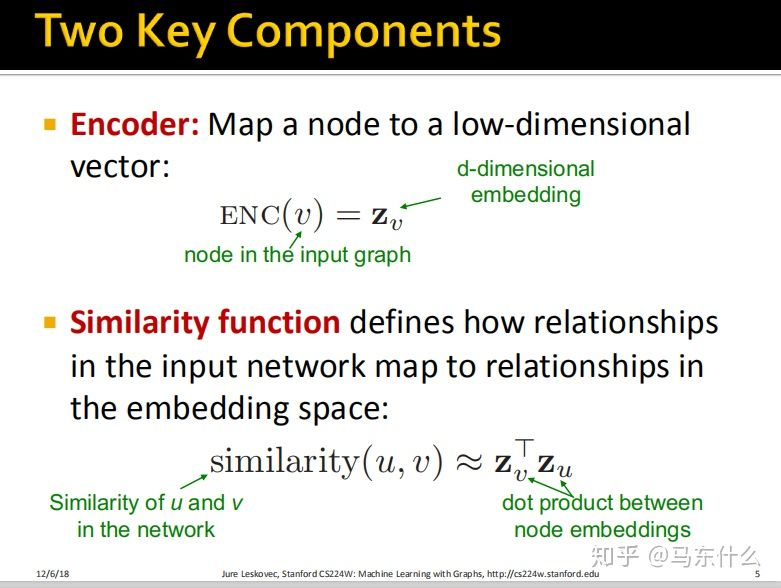

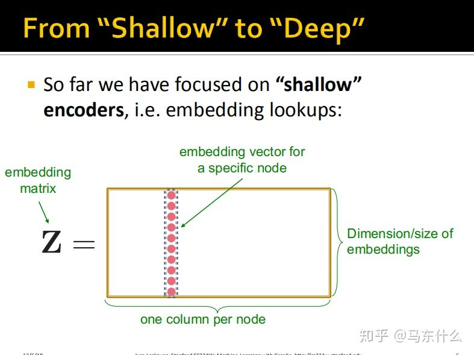

这些内容第七课实际上都已经介绍过了，所以就不赘述了。

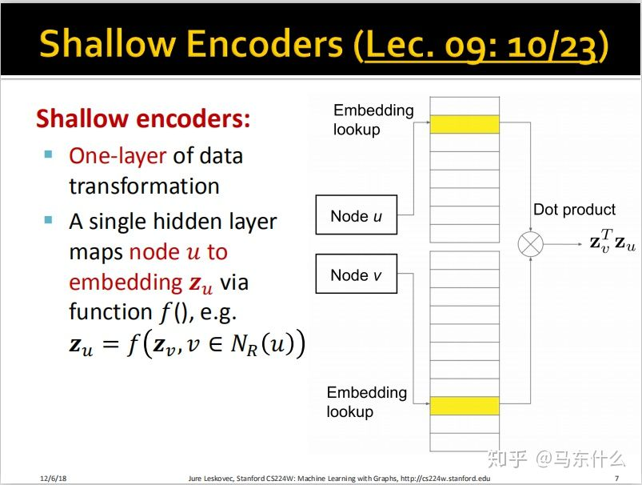

我们之前所提到的deepwalk也好，node2vec也好，都属于浅层的encoders

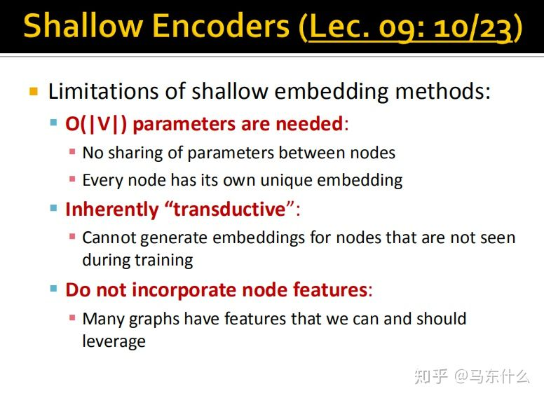

那么浅层的encoders有哪些缺陷呢？

1、太多参数：v个节点就有v个embedding，并且nodes之间不共享参数，每一个node都有其独立的embedding，那么如果embedding的维度是100，有100万个节点，我们就要训练1亿个参数。

2、固有的局限性： 无法为训练期间未见的节点生成embedding，这就好比word2vec对于未见过的词无法进行embedding一样；woe对于没见过的类别无法编码一样；除此之外，当我们在一个网络上训练得到了各个节点的embedding，然后比如时间长了，网络里又增加了很多新的节点和边，那么我们又得重新训练一次，

3、压根没用上node的feature啊：我们在cs224w第七课中，deepwalk和node2vec压根没有用到每一个节点的属性特征，比如某个user的节点，会有age、gender之类的特征，我们在embedding的时候也应该将这些考虑尽量，因为如果两个节点的属性完全相同很可能也代表了这两个节点非常接近，所以他们在embedding的空间里按理说也应该接近。

那么这里，我们就引入了——deep graph encoder

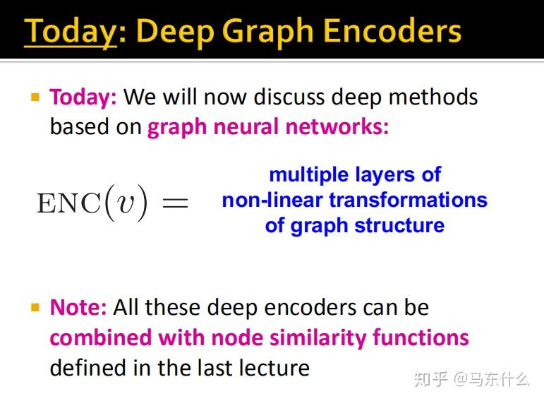

上一节课我们这里的ENC(V)如下：

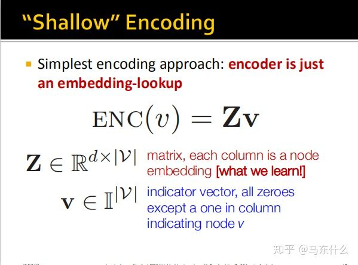

注意，所有的deep encoders都可以和上一节课我们介绍的node similarity functions结合起来。

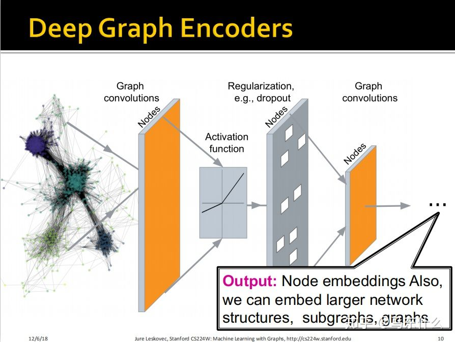

这个地方其实我一直在概念上比较困惑，因为总是不自觉地联想到DNN和CNN，在普通的深度学习的领域里，DNN是普通的全连接层，CNN则是带有卷积和池化层的特殊结构，二者应该是两种不同的结构所以总是误以为有一种GNN的图网络结构和一种GCN的图网络结构。。。实际上这里的GNN指代的是nn的概念，即CNN属于nn的一种，GCN属于GNN的一种。另一方面，GCN有广义和狭义之分：

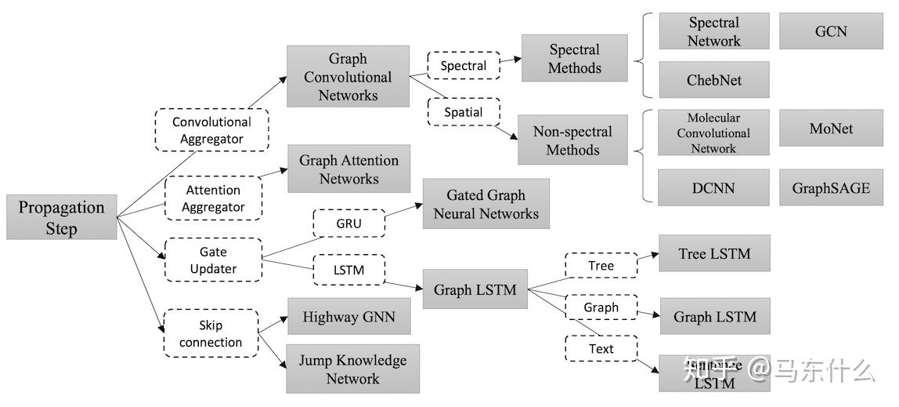

这节课谈到的GCN属于狭义的GCN，也就是上图最右边的那个。这也是2017年的论文《semi-supervised classification with GCN》里所谈到的结构，是目前我们经常谈论到的那种GCN。

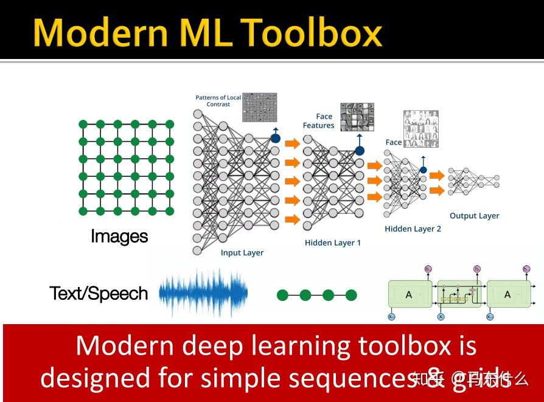

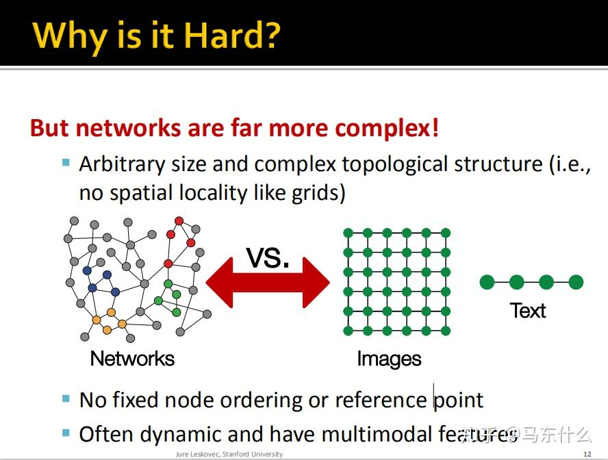

这些实际上都是综述里的内容，这里引出了为什么我们使用常规的nn结构无法处理图数据：

1、 图中的节点没有固定的顺序或参考点，而我们使用cnn或rnn所面对的数据都是fixed size，固定大小的，每一张图片的大小都处理成完全一样的，每一个序列都会通过补零然后mask从而达到同样size的效果；

2、网络常常是动态的并且具有多模态特征；

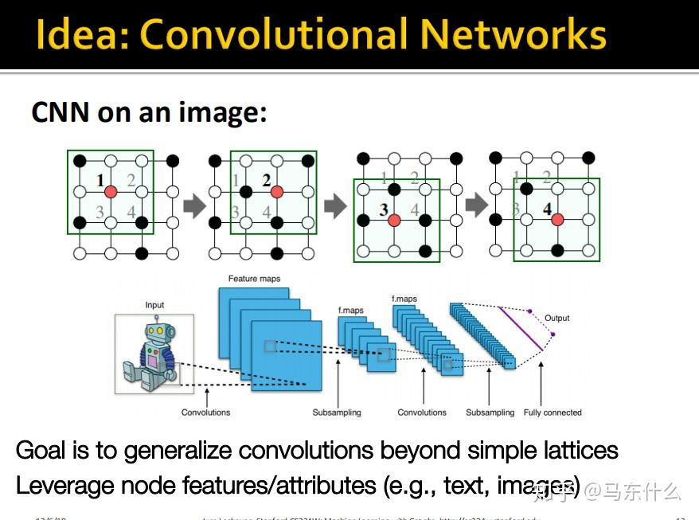

我们希望能够将CNN的思路推广到网格结构之外，充分利用节点的属性（例如文本或图像）。

（这里建议看下gnn的综述，里面详细介绍了图像和文本都属于图数据结构的一种）

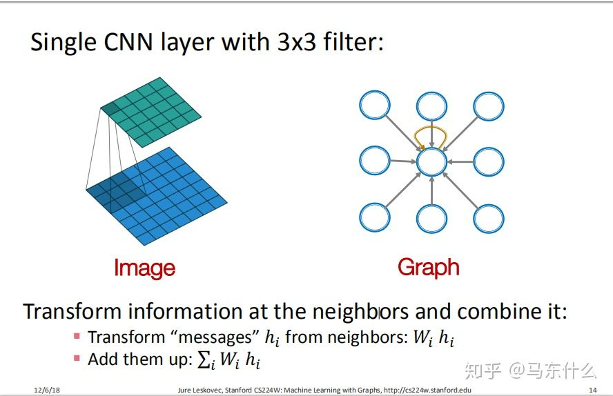

上图左边为一个简单的3X3的卷积核，其计算的本质就是对wi*hi进行求和比如原图中的9个像素点hi代表了9个输入，每个输入对应一个wi，即连接权，然后进行加权求和再进入activation function。我们前面提到过图像属于图数据的一种，因此这里也可以从图数据的角度来描述，如右图，因为cnn传播的时候所有节点都参与了加权求和，对应到图上就是中心节点再加一个自循环进来，这样实际上右图也一样可以表示为加权求和的形式。这样我们就把cnn的输入转化为用图来描述。

这样我们就可以用常规的cnn处理这种规整的图数据了，然而：

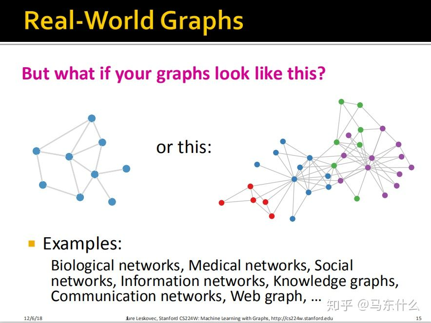

现实中的网络复杂的多，比如上面这样形式的图，就没办法用cnn来处理的。。。

这种结构别说cnn，目前我们常见的模型都无法接受这种形式的数据作为输入，

所以我们该怎么做才能像在图像上使用卷积层来slide（卷积层按照步长滑动）那样在graph的数据上slide呢?

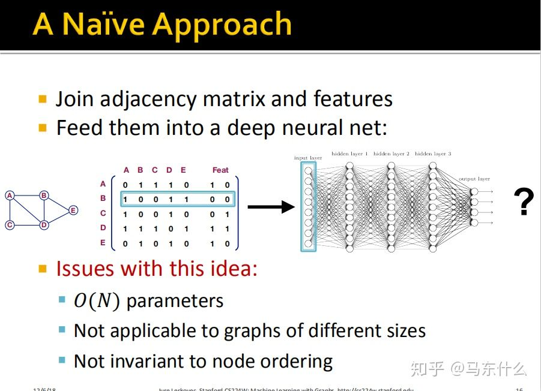

一个简单的思路，我们把图转化为其领接矩阵的形式，然后这个邻接矩阵和node的属性组成的特征矩阵合并（concat）在一起，如上图，这样就转化为一个规整的二维矩阵了，这样我们就可以用一个普通的nn结构或lr、gbdt之类的算法来处理了；

然而这种做法的坏处也很明显：

1、如果node的数量非常多，那么最终的合并矩阵的维度会非常大，高维稀疏的情况下非常容易过拟合；

2、这种情况下训练出来的模型对于不同size的网络用不了。比如我们原来是100个node，扩展成100维加上原来计入50维的node feature一共150维，然后我们训练一个nn，这个nn只能接受150维的输入，然后新的网络有500个node，concat之后是550维，这样我们就面临了输入数据的异构问题了；

3、显然破坏了图的结构信息，比如A和E是二度关联的，但是转换成领结矩阵之后我们无法直接观察到这种关联；

4、这里提到了第四点，就是比如我们保持原始的图结构不变，然后变换了node的位置，但是领域信息是完全不变的（建议自己把node换一下然后看看每个节点的领域关系是否改变就知道了）但是其领接矩阵确发生了变化，显然我们希望这种变化对于模型来说没有影响。

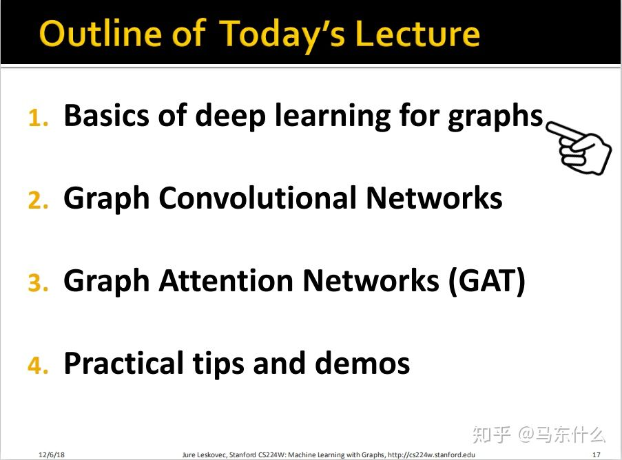

## 图机器学习基础

这里介绍了这节课的大纲，打算暂时先翻到第二节，

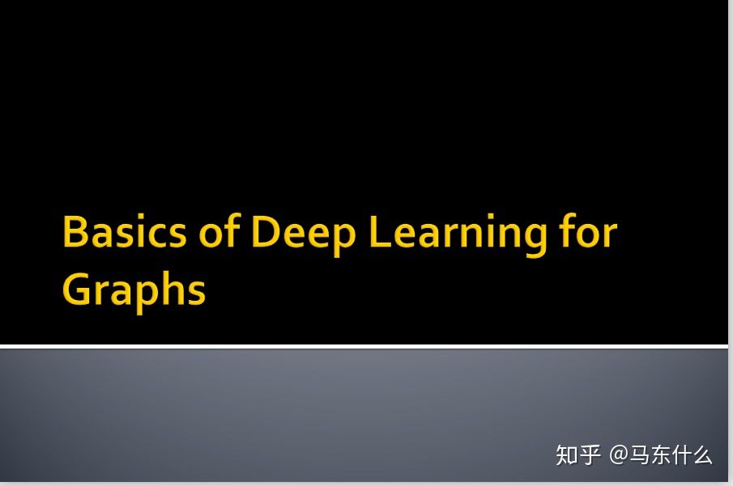

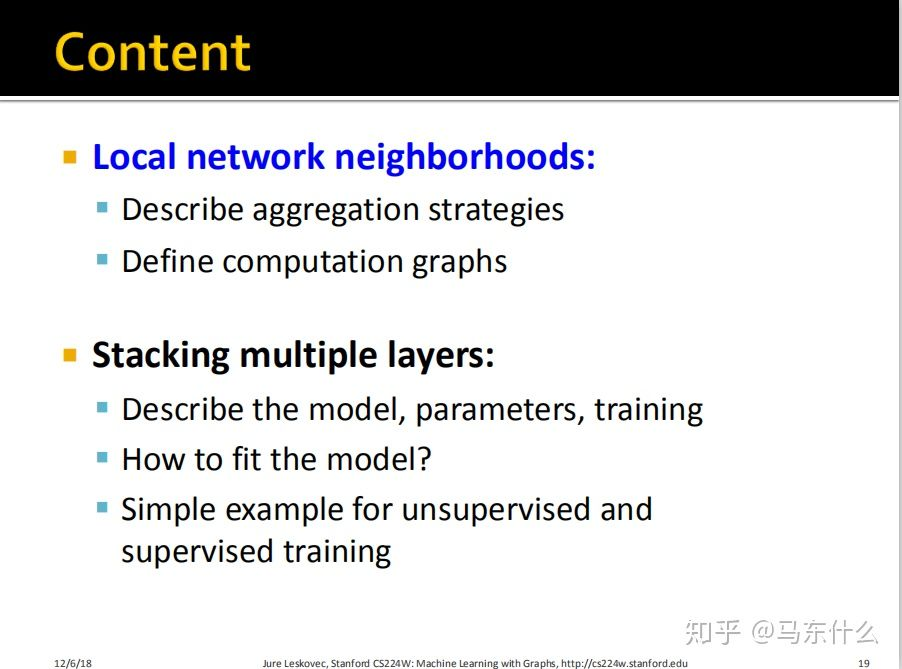

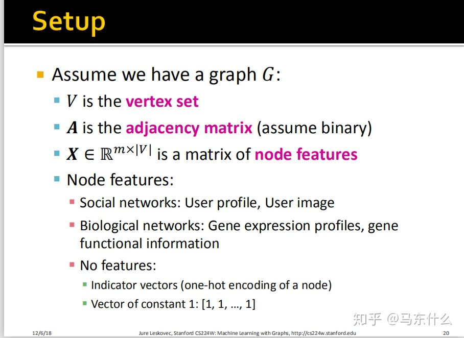

我们给定一个图结构，V是节点的集合，A是图的领接矩阵，X是节点的属性矩阵组成的特征矩阵。

node features有，比如：

社交网络：用户信息与用户画像等；

生物网络： 基因表达谱、基因功能信息

数字特征：指示向量（节点的独热编码）

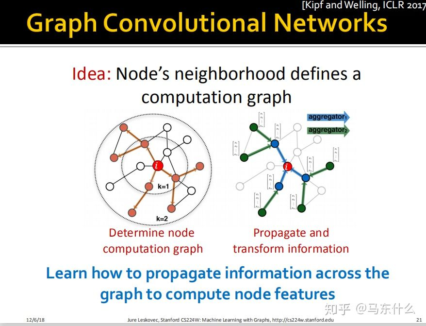

这里我们希望学习如何通过图的结构来传播信息从而计算节点的embedding，说白了就是不仅像node2vec那些算法那样考虑节点和节点之间的关联关系还要考虑节点的属性（特征）。上图的k=1表示一度关联，2表示二度关联 。比如 node i，我们后面介绍的方法不仅能够捕获到node i所在图的结构信息，还能够捕获node i的邻节点的属性信息从而增强embedding的表达能力。

## 图卷积和GraphSAGE

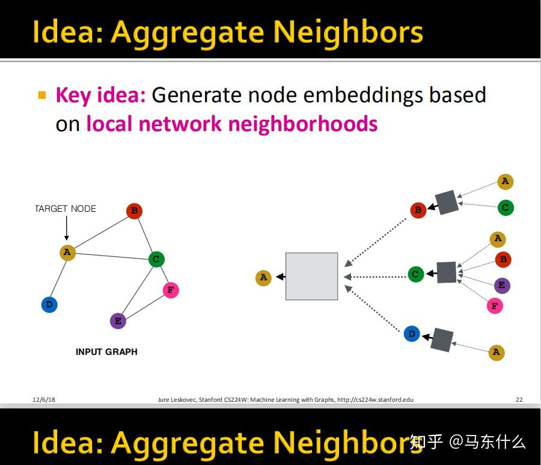

这里就看的非常明白了，例如我们要计算A的embedding，我们希望能够collect来自B、C、D的信息，而B、C、D又分别collect来自其各自的领域的信息，这里可能有点懵逼，node的属性到底是在哪里参与了这个网络结构，答案就是

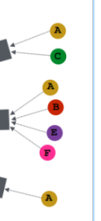

**here，这里是layer-0，第0层，这里的输入都是节点的属性**。这样我们就巧妙的把node A的邻节点的属性考虑进来了，同时node A所在的网络的结构也一并考虑进来了，因为不同的结构会使得最终embedding的结果不同，通过这种方式捕获的结构的信息。

（这里学生问了一个我也想问的问题，如果说整个网络非常复杂，A的领节点B存在邻节点C，而邻节点C存在一个更远的邻节点D，邻节点D存在一个更更远的邻节点E，那么我们是不是也要 统一考虑进来，这里教授的答案是“no need”。。。。额。。。）

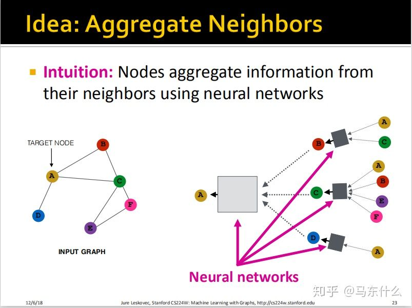

到这里还有一个问题，这些box到底是什么东西？

关于box，我们目前只知道有一点需要满足，就是这个box中的函数对于输入节点的顺序是完全不敏感的，比如第一个灰色box的输入是A和C节点，我们替换A和C的顺序之后，经过这个box function之后的结果应该是不变的。

后面会描述清楚的。

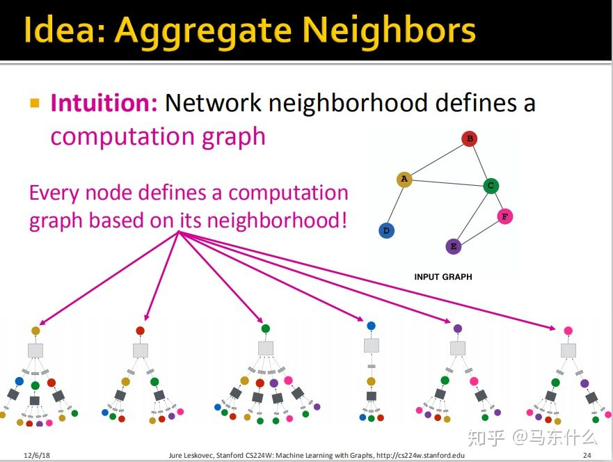

那么通过刚才的思路，我们为每一个节点都进行了上面所说的展开的方法进行展开得到了上图。

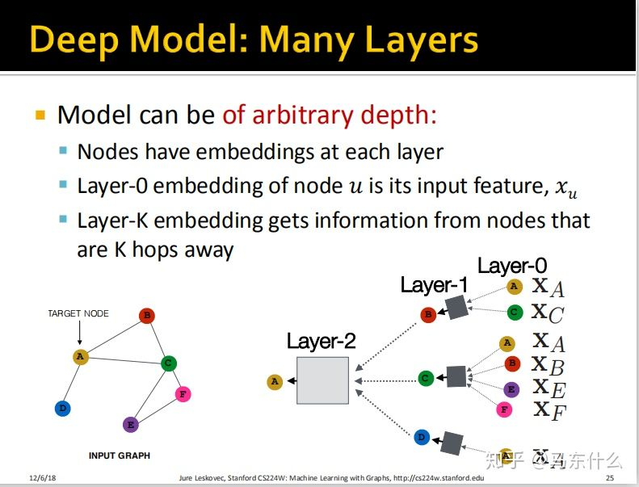

这里整个deep graph encoder的结构就出来了，我们的输入是target node的邻节点，输出是target node的embedding。

需要注意，以节点C为例，layer-0节点C是C的features，比如C是一个用户，那么就可能是用户的age、gender、nationality等，但是除了layer-0之外，其它的layer里，C都是一个embedding。这是一个很奇怪很有意思的地方。

模型可以是任意深度的：

1、nodes在每一层都有embeddings；

2、layers-0的embedding是就是每一个节点的属性对应的Xu，就是特征向量了；

3、第K层的embeddings 从k hops 远的nodes获得信息。

上图是一个二层的结构（这里box代表了层），这意味着我们取的是node A的2 hops away的邻节点，这里又提到了为什么我们不继续go deep的问题，如果我们考虑太远的节点，会把太多的结构信息考虑进来，举一个极端的例子，比如我们go 20 steps deeper，可能会把整个网络结构的信息考虑进来（这里是我自己的思考，我们以word2vec为例，假设一个句子有10个单词，而我们的windows是10，这就意味着在这个句子中，每个单词的embedding表示最终都是由这个句子中所有的单词一同参与训练的，这会导致最终这个句子中所有的单词训练出来的embedding接近一致，这显然不是我们想要的结果。）

另外，假设我们图中的F直接又接入了一个G，这个G仅仅和F连接而不和其它所有的已知节点有连接，那么我们就要在F的屁股后面接入一个box，这个box的输入是F的邻节点E、C、G。

btw，问了一下，之所以我们不go太过deeper，一方面引入太多的领域信息：

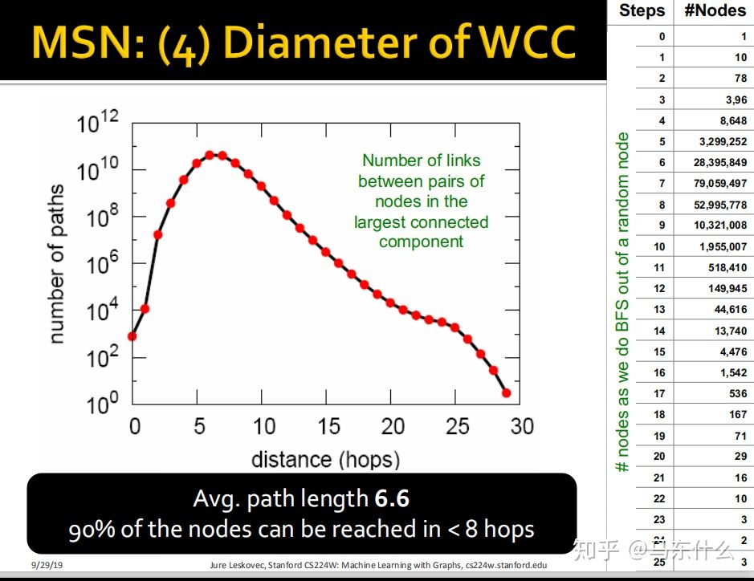

90%的nodes会在8hops之内访问到，因此这意味着hops取得太大，会导致最终每个节点的embedding的计算过程中，输入的features几乎差不多，从而最终导致over-smooth的问题，即每个节点最终计算出来的embedding接近一致。

这类似于我们使用word2vec对一篇文章中的每个词进行向量化，windows取得太大使得整篇文章的词语都参与了每一个词的embedding训练——换句还说，每个词都在每个词的附近。。。最终结算的结果当然是所有的embedding都差不多了。。。

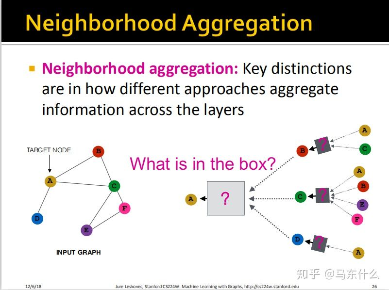

现在一个重要的地方在于我们如何汇总各层的信息，也就是这些带问号的box里面是什么函数？

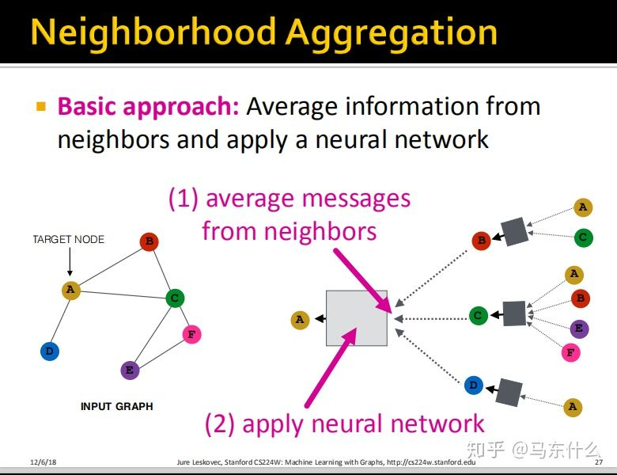

最简单的思路，我们把所有来自于邻域的信息进行平均然后输入一个nn结构即可；注意，所有的box都是这样的，箭头的地方先进行average，然后送到一个nn的结构里。也就是box前面的箭头是average，box里面是一个nn。

把整个过程用公式来表示就是：

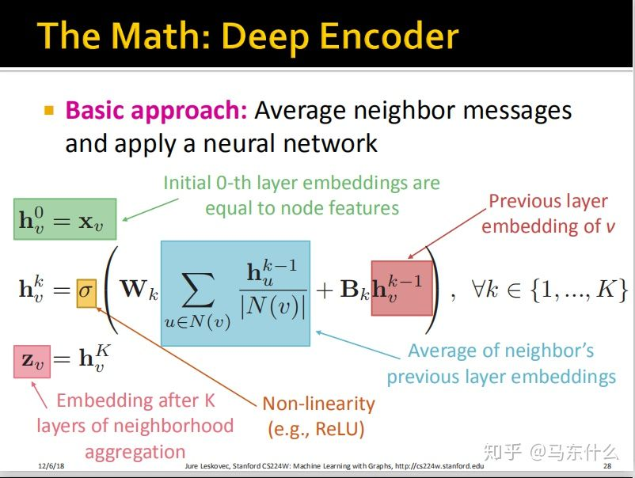

这个过程用公式来表示如上图，这就是狭义的GCN的整个前向传播的过程了。这里，如果Wk全是0，则意味着我们根本不考虑邻节点的信息，这个时候这个GCN的结构就退化成了普通的MLP（DNN）。如果Wk非常非常大，Bk相对非常非常小，则相当于我们只考虑了邻节点信息而忽略了自身的信息。具体应该怎么去分Wk和Bk的大小，是由整个模型训练的过程中自己决定的。

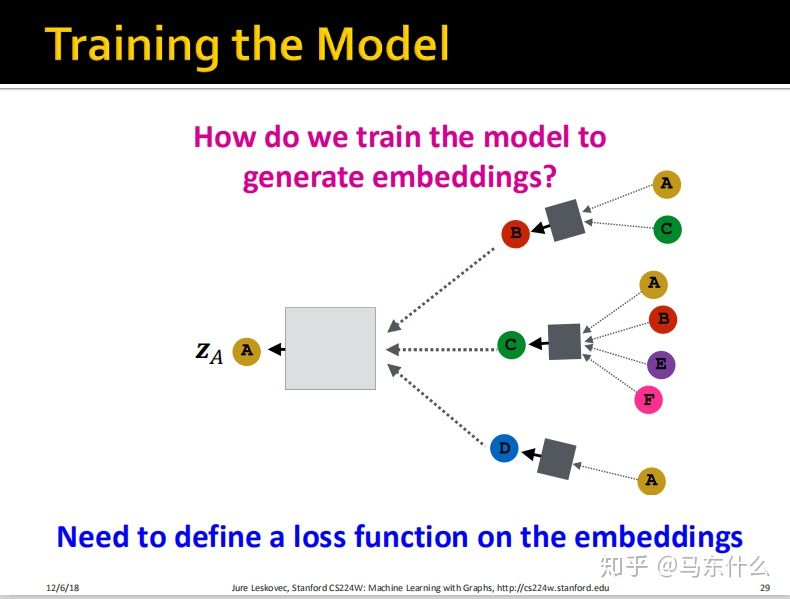

这里我们定义完了前向传播的过程，还缺一个损失函数。

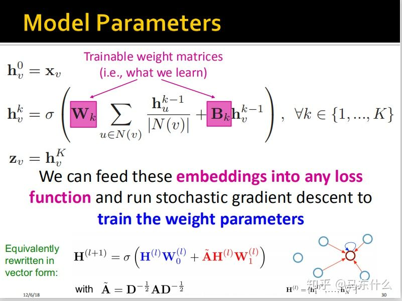

这里，我们把上面的公式表达成矩阵的形式，如上图，其中H(l+1)表示所有node的在l+1层的embedding表示，H(l)同理，A表示graph的领接矩阵，D表示graph的度矩阵，关于graph常用的矩阵的含义可见：

[CSDN-专业IT技术社区-登录blog.csdn.net](https://link.zhihu.com/?target=https%3A//blog.csdn.net/weixin_43330946/article/details/102802768)

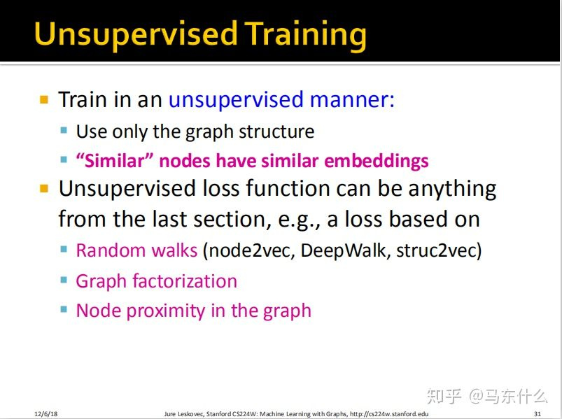

损失函数可以使用random walks定义的损失函数也可以用graph factorization或者node proximity的损失函数。比如第七课用过的：

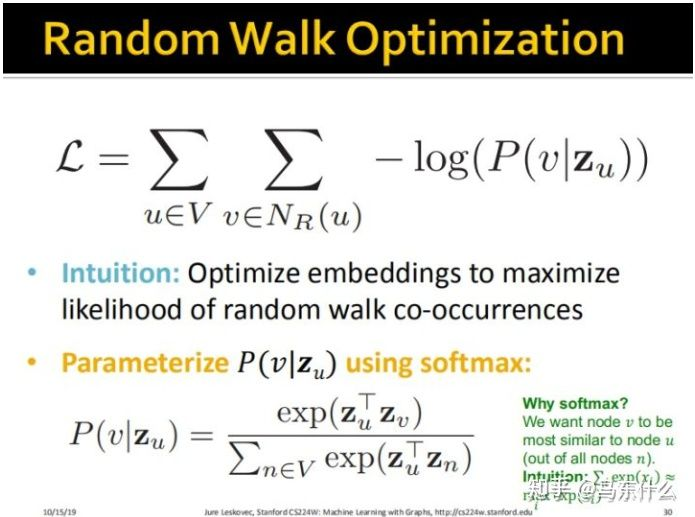

，这样损失函数也确定下来惹~，我们就在自动微分的框架下快乐的等待整个网络训练到收敛为止。

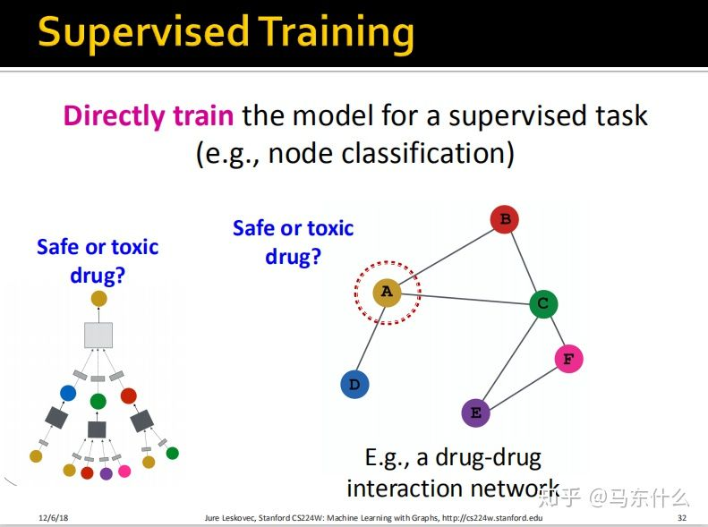

除此之外，我们可以直接在最终的输出上接一个分类层，然后使用分类的损失函数比如交叉熵作为最终的损失函数。

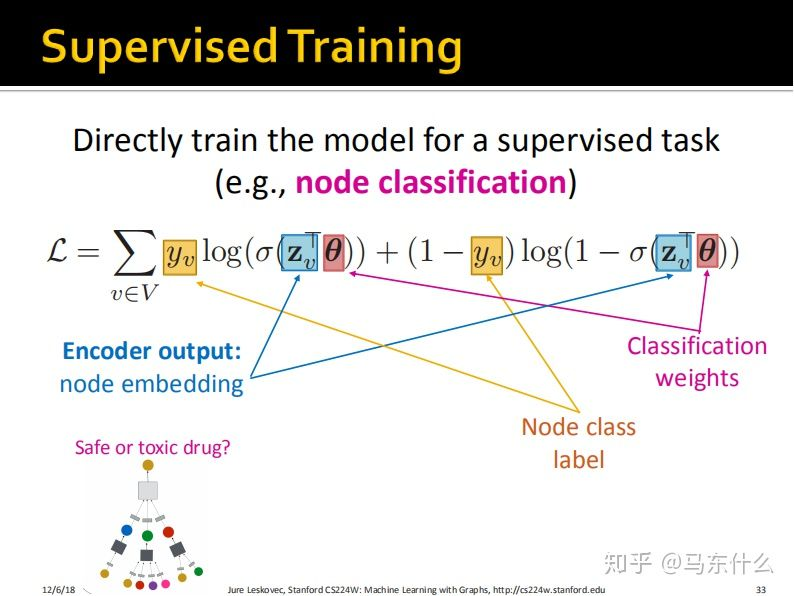

这里公式写的非常明了了。

下面进行了一个完整的总结：

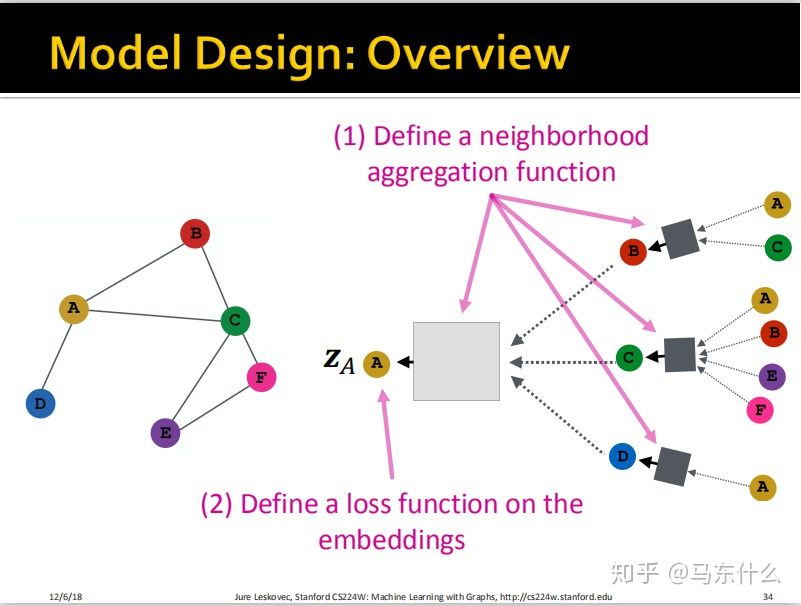

1、我们定义一个neighborhood aggregation function，狭义的GCN使用的就是简单平均的策略；

2、我们定义一个funtion用于指导GCN进行反向传播更新权重参数W和B；

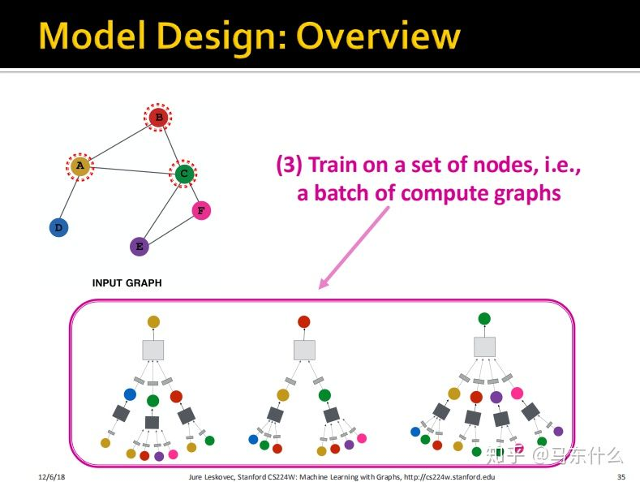

3、一个节点对应一个样本，我们在这些样本上进行训练；

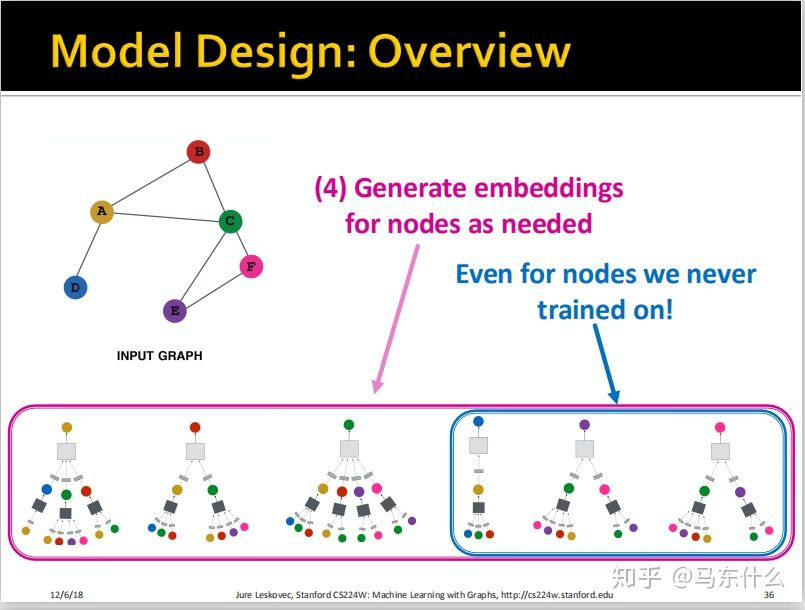

假设我们的训练集是node A、node B和node C，那么我们直接可以把训练完的model用于预测未见过的node B、E、F，这里就比较重要了，首先我们训练完毕的模型是什么样子的？

实际上我们训练完毕的model就是两个box：

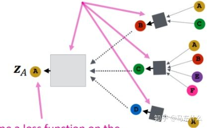

一个是浅灰色的box，一个是深灰色的box，这两个box都是nn的结构，具体是什么结构可以自己用普通的神经网络的方法来定义。另一个重要的地方在于，可以看到深灰色的box有3个，实际上只有一个，这3个浅灰色box进行了权值共享，是不是和CNN里的卷积核非常相似？实际上CNN里的卷积核的传播形式展开之后也可以表示成上面的形式的。

所以，对于new node，我们可以很轻易的使用已经训练完的两个box来进行预测得到最终的结果。

见下：

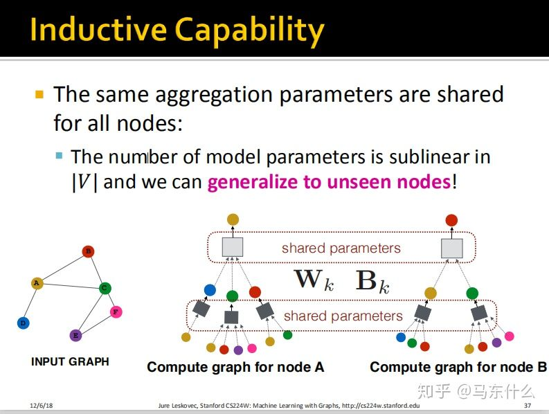

我们最终share的权重如上图，这里就是体现gnn权值共享的地方。可以看到，相对于node2vec和deepwalk这种算法，deep graph encoders可以对unseen的node进行embedding，而node2vec和deepwalk无法实现这样的功能，并且deep graph encoders还考虑了node的features，使得最终的embedding结果更加expressive。

不仅如此，即使是新的graph结果，我们也可以直接apply原来的model了！简直太牛逼了！！

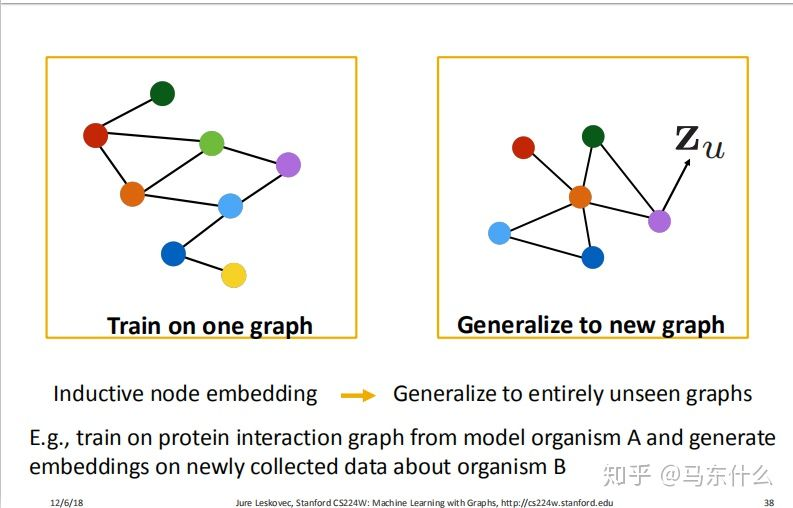

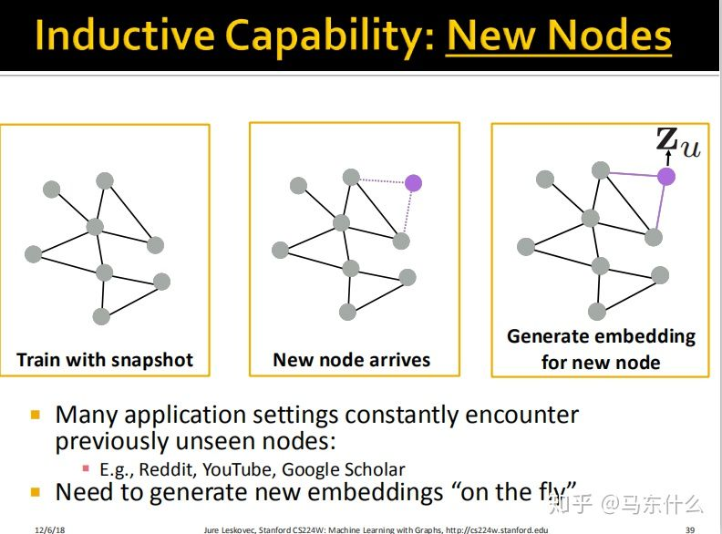

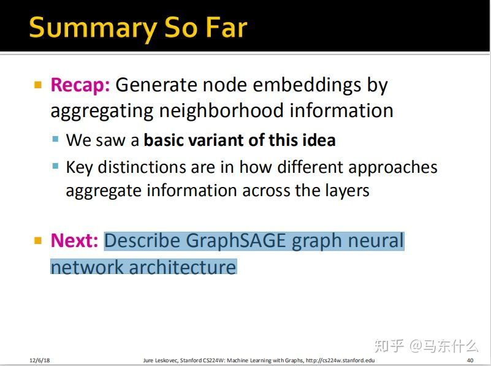

